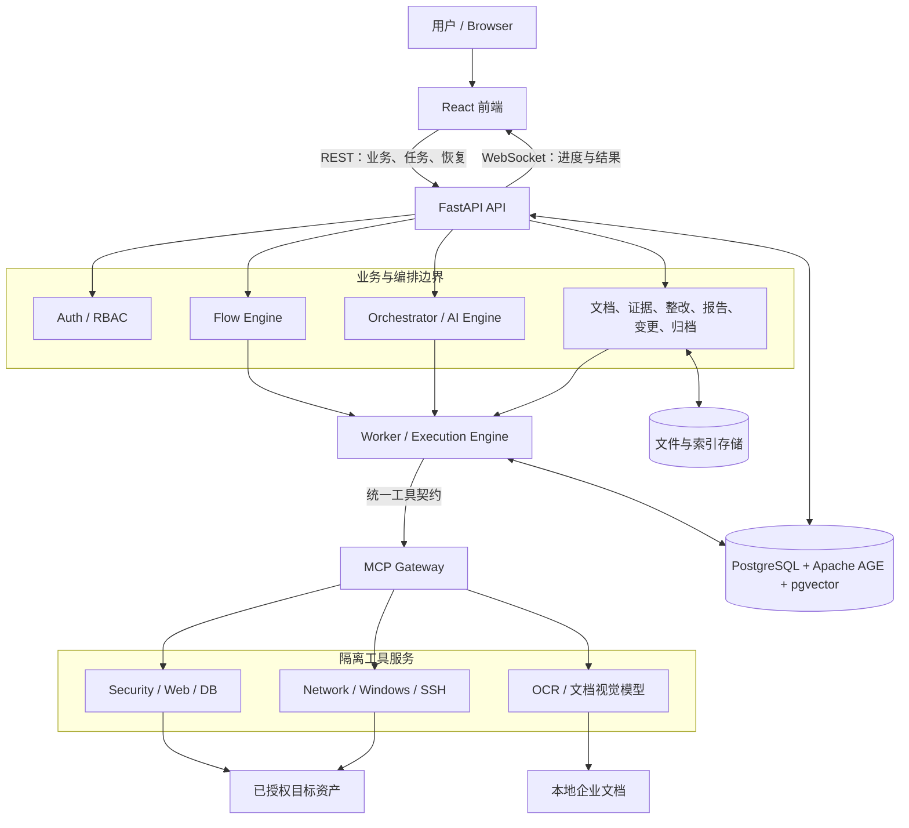
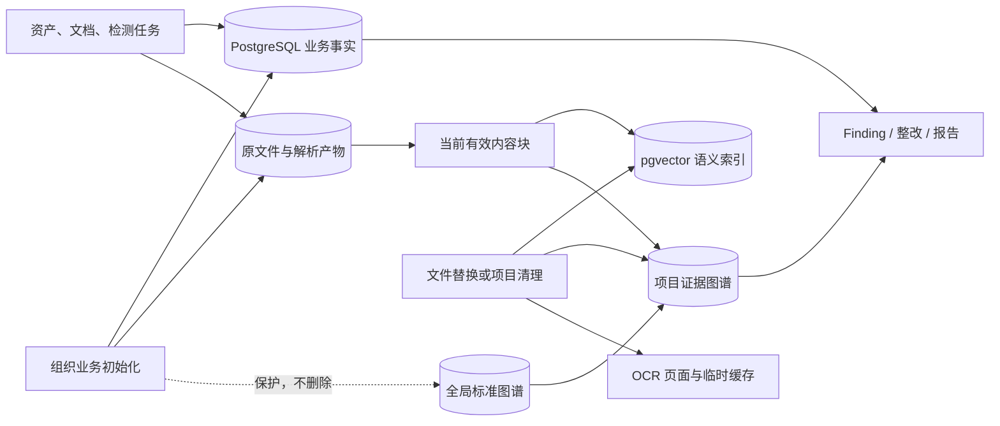
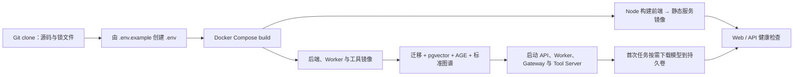
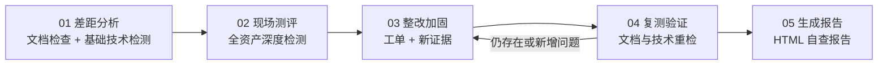
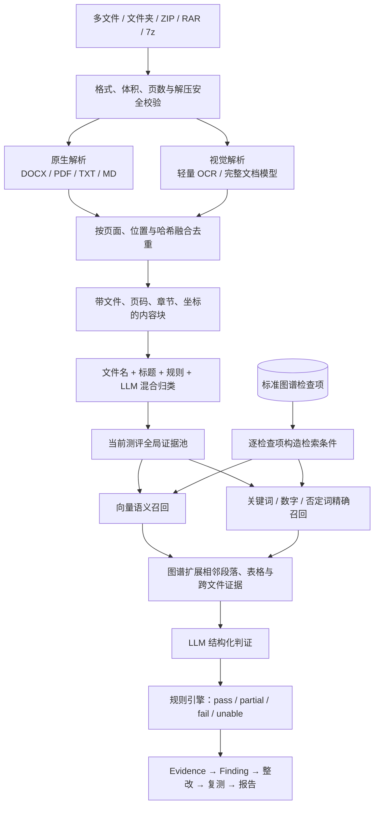
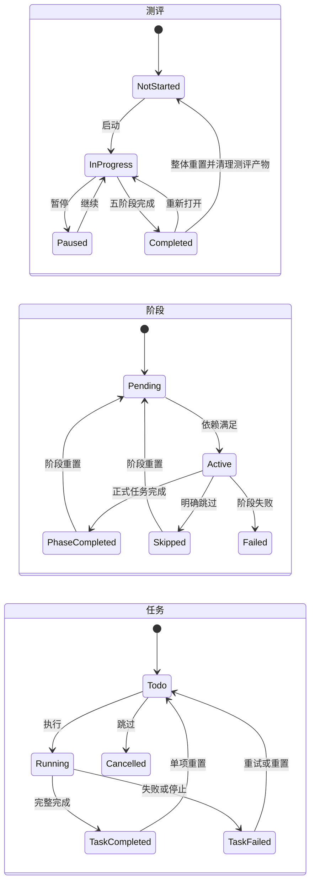
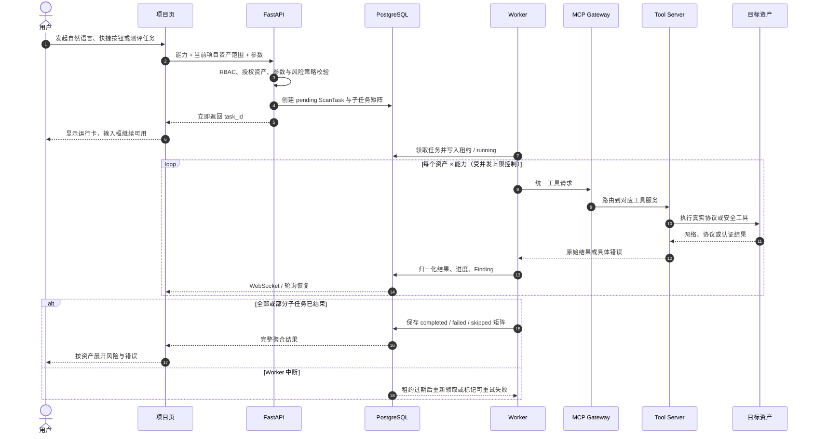
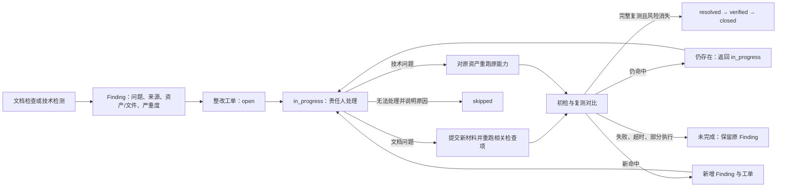

# CertiProof 产品设计文档

> 本文档是 CertiProof 当前产品设计与系统架构的唯一权威说明，覆盖定位、模块、数据边界、逐步流程、异常处理和验收口径。

## 一、项目概括

CertiProof 是面向被测评企业的等保合规自查平台，目标不是替代测评机构，而是帮助企业在正式测评前回答四个问题：

- 我现在是否合规？
- 哪些文档、资产、配置或服务存在差距？
- 每个差距应该如何整改？
- 整改后是否真的改善，并能否生成可读报告？

产品采用“组织态势 Dashboard + 项目工作台 + AI 对话执行 + 自动化检测 + 文档合规分析 + 整改复测 + HTML 报告”的闭环设计。用户可以通过项目页对话、快捷命令和统一工具入口触发检测，也可以按等保自查流程逐项推进。

### 1.1 目标用户

| 用户 | 主要诉求 |
|------|----------|
| 企业安全负责人 | 快速掌握组织整体合规态势、风险分布、项目进度和整改状态 |
| 项目执行人员 | 管理项目资产、上传制度文档、执行安全工具、跟踪复测结果 |
| 运维/系统负责人 | 根据发现项定位责任资产、提交整改内容、配合复测 |
| 管理者/审阅者 | 查看报告、项目进度、角色权限和审计结果 |

### 1.2 产品边界

CertiProof 聚焦企业自查和整改闭环：

- 支持自动化文档检查、技术检测、差距发现、整改跟踪、复测验证、HTML 报告。
- 不做测评机构的人员访谈、人工深度测评流程管理。
- PDF 报告不是 MVP 主格式，当前报告中心以 HTML 报告为核心。
- 自动化结论以“标准库 + 证据提取 + 模型判证 + 规则引擎汇总”为主，不要求人工确认后才生成差距结果。

## 二、项目结构

```text
CertiProof/
├── frontend/               # React 前端应用
│   └── src/
│       ├── pages/          # 页面：登录、Dashboard、项目/资产、报告、设置、结果详情
│       ├── components/     # 业务组件：项目工作台、等保进度、拓扑、结果卡、聊天工作区
│       ├── services/       # API 客户端
│       └── store/          # 登录态和组织态
├── backend/                # FastAPI 后端应用
│   └── app/
│       ├── api/            # REST/WebSocket 接口
│       ├── models/         # 数据模型
│       ├── schemas/        # 请求/响应结构
│       ├── services/       # 产品业务服务
│       ├── orchestrator/   # AI 编排与任务调度
│       ├── mcp/            # 工具网关客户端
│       └── core/           # 配置、数据库、安全、RBAC、脱敏
├── mcp-servers/            # 安全工具与 OCR 工具服务
├── scripts/                # 检查、演示、回归脚本
├── tests/                  # 自动化测试
├── artifacts/              # 本地生成的演示报告和测试产物
├── docs/                   # 项目文档
├── docker-compose.yml      # 本地和容器化部署编排
└── README.md
```

### 2.1 前端页面结构

| 路由 | 页面 | 产品作用 |
|------|------|----------|
| `/login`、`/register` | 登录/注册 | 进入组织工作区，建立用户和组织身份 |
| `/dashboard` | 组织态势 Dashboard | 查看全局项目进度、风险队列、资产暴露面、工具遥测、权限治理入口 |
| `/projects` | 项目与资产工作台 | 管理项目、资产矩阵、归档/恢复、演示项目和资产授权范围 |
| `/projects/:projectId` | 项目执行页 | 承载 AI 对话、工具执行、等保测评、文档上传、整改复测 |
| `/projects/:projectId/results` | 检测结果 | 查看项目扫描任务、检测结果和详情 |
| `/reports` | 报告中心 | 生成、预览和下载 HTML 报告 |
| `/settings/organization` | 组织与角色权限 | 管理成员、角色和权限 |
| `/settings/models` | 模型配置 | 配置 AI 模型和供应商 |

### 2.2 后端能力结构

| 层级 | 主要模块 | 产品职责 |
|------|----------|----------|
| API 层 | auth、projects、assets、chat、assessments、remediation、reports、dashboard、organizations | 对前端提供组织、项目、测评、文档分析、检测、整改、报告等接口 |
| 编排层 | Orchestrator、AI Engine、Execution Engine、Context Manager | 理解用户指令，生成执行计划，调度工具，恢复任务和组织结果 |
| 业务层 | Flow Engine、Document Pipeline、Document Control Engine、Evidence、Remediation、Report、Change Detection | 支撑 5 阶段测评、文档合规、证据整改、复测、报告和变更提示 |
| 数据层 | Project、Asset、Assessment、Finding、Evidence、RemediationTicket、ScanTask、Organization、Role、Archive | 持久化项目、资产、流程、结果、权限和归档信息 |
| 工具层 | MCP Gateway、security/web/db/network/windows/ssh/ocr servers | 执行端口、漏洞、Web、数据库、弱口令、基线、OCR 等检测 |

### 2.3 运行架构与调用边界



边界规则：
- API 负责授权和创建持久化意图，不在请求生命周期内等待长扫描完成。
- Worker 负责长任务执行；任务状态、进度和结果必须写入数据库，前端内存不是事实源。
- MCP Gateway 只负责工具路由、健康和统一调用，不负责项目权限或业务结论。
- Tool Server 返回真实工具结果和错误事实，不直接决定等保合规结论。
- LLM 可以理解指令和证据，但目标范围、权限、检查标准和最终规则结论由确定性代码约束。

Flow Engine 不并入 Orchestrator 或 AI Engine。三者协作但所有权不同：

| 模块 | 权威职责 | 不能负责 |
|------|----------|----------|
| Flow Engine | 五阶段、阶段依赖、任务状态机、进度、重置、事件和审计事实 | 自然语言理解、自由生成流程状态 |
| Orchestrator | 接收入口请求、组合上下文、编排 Skill/能力、聚合异步结果 | 绕过 Flow Engine 直接改测评状态 |
| AI Engine | 把自然语言转换为受约束的结构化计划和参数 | 决定权限、资产范围、最终合规结论 |
| Execution Engine / Worker | 领取持久任务，执行工具或文档流水线并回写结果 | 定义五阶段业务规则 |

集成方式是“Orchestrator 调用 Flow Engine 的命令，Flow Engine 把需执行任务交给 Worker，执行结果再由 Flow Engine 推进状态”。保持独立可以让暂停、重启、重置和审计不依赖 LLM 输出，并避免对话层故障破坏测评事实。

### 2.4 数据与存储职责

| 存储 | 保存内容 | 生命周期 |
|------|----------|----------|
| PostgreSQL | 用户、组织、角色、项目、资产、测评、任务、Finding、证据、整改、快照、归档、报告元数据及文档内容块 | 业务事实源，按权限和删除规则持久化 |
| Redis | 短期缓存、队列协调和临时状态 | 可重建，不作为最终结果唯一来源 |
| 文件存储 | 上传原文、证据附件和需保留的解析附件；HTML 报告按需生成 | 跟随项目、测评和文件删除策略 |
| pgvector | 当前有效文档内容块的 1024 维语义向量和 HNSW 索引 | 嵌入、精确/向量混合召回和替换清理均为 `implemented`；可由内容块重建 |
| Apache AGE 标准图谱 | 标准、文档类型、检查项、证据要求、判断规则和整改建议 | 引擎、版本记录和 10 类/80 必检点入图 `implemented`；全局保护、版本化、项目清理不可删除 |
| Apache AGE 证据图谱 | 文件、内容块与检查项的支持、部分支持或矛盾关系 | 文档流水线自动同步、文件替换和项目/组织清理均为 `implemented` |
| 日志 | 服务健康、任务链路、工具错误和审计事件 | 脱敏并按运维保留期轮转 |

Apache AGE 是 PostgreSQL 的属性图扩展，也就是本系统实际使用的图谱引擎，不是前端图谱组件。它用节点和关系表达“标准版本 → 文档类别 → 检查项 → 证据要求 → 判断规则 → 整改建议”以及“项目文件 → 内容块 → 支持/矛盾检查项”。选择 AGE 是为了与业务表、pgvector、事务、权限、备份和高可用共用 PostgreSQL，同时使用 Apache License 2.0，避免额外部署和授权商业图数据库。关系事实放 AGE，敏感原文和业务状态仍留在 PostgreSQL，语义相似度仍由 pgvector 负责。

核心所有权：Project 是业务隔离边界，Organization 是权限隔离边界，Assessment 是测评状态边界，ScanTask/DocumentRun 是异步执行边界，Finding 是整改闭环起点，Evidence 是所有结论的追溯依据。



### 2.5 容器部署与可复现构建

- Git 仓库保存完整源码、锁文件、Dockerfile、Compose 编排、迁移和标准库；不依赖本机生成且被忽略的 `frontend/dist`。
- 前端镜像采用多阶段构建：Node 20 容器执行 `npm ci` 和 Vite 构建，再把静态产物复制到轻量 Python 静态服务镜像。
- 全新部署先由 `.env.example` 创建根目录 `.env`，并必须替换数据库密码和至少 32 位的 `SECRET_KEY`。
- `docker compose up -d --build` 是标准启动入口；`migrate` 服务先完成数据库迁移、pgvector/Apache AGE 初始化和标准图谱装载，业务服务再启动。
- PostgreSQL、Redis、上传材料、OCR 模型和向量模型分别使用持久卷；普通 `down` 不删除数据，只有明确清库时才使用 `down -v`。
- 模型权重不进入 Git。向量模型和 OCR/视觉模型首次使用时从模型源下载到持久卷，后续启动复用缓存。
- 可复现构建仍依赖部署环境能够访问 Docker 镜像源、npm/Python 软件源和首次模型下载源；这些外部网络失败必须与源码构建失败区分显示。



## 三、信息架构

产品主线按“组织 → 项目 → 资产/文档/检测 → 发现项 → 整改 → 复测 → 报告”组织。

```text
组织
  ├── Dashboard：整体态势、项目矩阵、风险队列、工具遥测、权限概览
  ├── 项目
  │   ├── 资产：IP、域名、云资源、授权范围、服务暴露
  │   ├── 等保自查：5 阶段流程
  │   ├── AI 对话：自然语言、快捷按钮、/ 命令
  │   ├── 工具结果：单资产/多资产聚合结果
  │   ├── 证据与整改：Finding、整改工单、跳过、复测
  │   └── 报告：HTML 报告
  ├── 资产矩阵：跨项目资产视图
  ├── 报告中心：项目报告列表
  └── 组织设置：成员、角色、权限、模型配置
```

## 四、核心模块

### 4.1 登录、组织与权限

产品目标：
- 支持多组织、多成员协作。
- 通过角色权限控制项目、资产、扫描、整改、报告和组织设置能力。
- 在 Dashboard 和组织设置页展示当前角色拥有的权限范围，避免用户不知道“能做什么”。

核心功能：
- 登录、注册、Token 认证。
- 组织成员管理。
- 角色创建、权限赋予、成员角色变更。
- 项目访问和操作权限校验。
- 关键操作保留审计记录。

### 4.2 组织态势 Dashboard

产品目标：
- 作为用户进入系统后的指挥台。
- 展示“项目整体进度、风险处置压力、资产暴露面、工具健康度、权限治理状态”。
- 不承载对话指令，避免与项目执行页重复。

核心功能：
- 项目测评进度矩阵：按项目展示 5 阶段进度、问题数量、整改状态和下一步动作。
- 资产暴露面拓扑：以组织、项目、资产、服务为节点展示暴露关系，支持点击资产查看右侧详情。
- 风险处置队列：按状态筛选待确认、处理中、已闭环风险。
- 工具遥测：展示安全工具状态、可用性、最近执行情况。
- 角色与权限治理：展示组织成员、角色和权限数量级，跳转到权限配置页。

### 4.3 项目与资产工作台

产品目标：
- 将项目管理和资产管理合并成一个高密度工作区。
- 支持项目多了、资产多了之后仍能筛选、查看、归档和进入项目执行。

核心功能：
- 创建、编辑、归档、恢复、删除项目。
- 一键创建演示项目，用模拟资产、文档、发现项、整改和报告验证完整流程。
- 资产矩阵：跨项目查看 IP、域名、云资源、风险、所属项目和授权状态。
- 资产增删改查。
- 资产授权范围确认，未确认资产不应被默认用于扫描。
- `/assets` 旧入口重定向到 `/projects?view=assets`。

### 4.4 项目执行页

产品目标：
- 项目内所有实操集中在一个页面完成。
- 左侧/主区域保留足够聊天空间，因为自然语言执行检测是核心体验。
- 右侧展示等保进度、证据整改、变更提示等项目状态。

核心功能：
- AI 对话执行：用户可输入“对所有资产做 Web 扫描”等自然语言。
- 快捷按钮、`/` 命令和聊天指令共用同一工具目录，避免入口不一致。
- 多任务并发：执行中的扫描不阻塞用户输入下一条指令。
- 历史输入：支持回车发送、方向键调出历史命令。
- 结果展示：单资产、多资产、组合工具统一为聚合结果卡。
- 任务恢复：刷新后恢复运行中/已完成任务状态。

### 4.5 5 阶段等保自查流程

CertiProof 当前正式流程为：



| 阶段 | 产品目标 | 主要内容 |
|------|----------|----------|
| 差距分析 | 快速识别初始不符合项 | 10 个核心文档检查，基础技术检测，生成初始 Finding |
| 现场测评 | 执行更完整的自动化检测 | 全资产组合扫描、Web 深度扫描、数据库、SNMP、Windows/AD、SSH 基线等 |
| 整改加固 | 将发现项转化为可跟踪事项 | 整改工单、责任人、优先级、状态流转、跳过原因 |
| 复测验证 | 验证整改是否有效 | 文档重新分析、技术复测、整改前后对比 |
| 生成报告 | 输出企业自查结果 | HTML 报告，包含问题清单、状态、时长、时间线和变更提示 |

流程要求：
- 支持整体重置、阶段重置、子项重置。
- 完全重置时，测评进度、证据、整改、复测状态应一起重置。
- 部分重置只影响对应阶段或子项，不破坏其他阶段历史。
- “系统定级、备案”等旧模板阶段不再作为正式流程展示。

### 4.6 文档合规检查

产品目标：
- 对批量上传的企业材料做自动归类、取证和合规判断。
- 支持多文件共同提供证据。
- 输出能追溯到文件、页码、段落、表格或图片文字的证据。
- 文件名不规范只提示，不阻止内容分析。

> 状态：`implemented`。新文档子系统已经完整替换旧文档检查数据和算法，运行时只使用本节定义的内容块、标准图谱、混合检索、结构化判证和规则裁决链路。

处理链路：



内容解析：
- 支持 DOCX、PDF、TXT、MD、常见图片以及安全解压后的批量材料。
- DOCX 提取段落、表格、页眉页脚、列表和内嵌图片文字。
- PDF 提取原生文本、页码、坐标和阅读顺序；扫描件或复杂版式调用 OCR/视觉模型。
- 原生解析与视觉结果自动补充和交叉验证；重复内容合并，冲突内容保留来源及置信度。
- 每个内容块记录文件、页码、章节、类型、坐标、正文、表格、来源、置信度和内容哈希。

标准与证据架构：
- 10 类核心文档至少包含 80 个必检点，每项包含标准依据、必需证据、通过条件、缺失条件、严重程度和整改建议。
- 正式知识图谱是运行时标准库；YAML 只用于初始化、版本控制、导入导出和灾难恢复。
- 图谱引擎采用 Apache AGE，不使用 Neo4j Enterprise/Aura 等商业授权能力。AGE 使用 Apache License 2.0，并与 PostgreSQL 的事务、权限、备份和高可用体系共用同一数据底座。
- PostgreSQL 保存业务事实和带位置内容块，对象存储保存原文件和解析产物，pgvector 保存当前有效内容块的语义索引；图谱节点只保存业务 ID、哈希和关系，不复制整篇敏感原文。
- 标准图谱保存“标准、文档类型、检查项、证据要求、判断规则、整改建议”关系；证据图谱保存“文件、章节、内容块、检查项、支持/部分支持/矛盾”关系。
- 向量检索负责语义召回，关键词检索负责数字、时限、标准编号和否定词，图谱负责补充相邻段落、表格和跨文件关系。
- LLM 只根据检查标准和候选原文输出结构化证据判断，不能自行创造标准或直接决定总分。
- 结论只有 `pass`、`partial`、`fail`、`unable` 四类；提取失败或模型不可用时必须是 `unable`，不能算通过。
- 同一个文档类问题在证据与整改中归并展示，可展开查看不同检查点。

首批标准库范围：

| 文档类别 | 最低检查重点 |
|----------|--------------|
| 信息安全管理制度 | 适用范围、管理原则、职责、制度生命周期、监督与违规处理 |
| 信息安全管理机构设置文件 | 组织架构、负责人、岗位职责、授权关系、沟通与汇报机制 |
| 人员安全管理制度 | 入职、在岗、调岗、离职、培训、保密、账号与权限回收 |
| 安全建设管理制度 | 需求、方案、开发、测试、上线、外包、验收和变更控制 |
| 安全运维管理制度 | 日常运维、访问控制、介质、备份、恶意代码、变更和应急处置 |
| 信息安全事件应急预案 | 事件分级、组织职责、报告、响应、恢复、演练和复盘 |
| 安全事件管理制度 | 发现、登记、升级、调查、处置、证据保存和关闭机制 |
| 安全审计管理制度 | 审计范围、日志内容、留存、保护、审阅、告警和责任分离 |
| 系统安全方案 | 系统边界、资产、网络、主机、应用、数据、安全控制和实施路线 |
| 信息安全策略文件 | 安全目标、治理原则、风险偏好、责任、例外、评审和发布机制 |

图谱核心实体和关系：

| 类型 | 核心实体/关系 | 作用 |
|------|---------------|------|
| 标准实体 | StandardEdition、DocumentType、Control、EvidenceRequirement、DecisionRule、RemediationGuidance | 定义检查依据和最终裁决条件 |
| 内容实体 | Document、Page、Section、Block、Table、ImageText | 保存文档结构和可定位原文 |
| 业务实体 | Organization、Project、Assessment、DocumentRun、Finding、RemediationTicket | 连接文档分析与产品闭环 |
| 结构关系 | CONTAINS、NEXT、CHILD_OF、REFERENCES | 扩展相邻段落、表格和跨文件上下文 |
| 判证关系 | SUPPORTS、PARTIALLY_SUPPORTS、CONTRADICTS、MISSING_FOR | 保存检查项与证据之间的可解释关系 |
| 闭环关系 | PRODUCES、REMEDIATED_BY、RETESTED_BY、RESOLVES | 连接结论、整改动作和复测结果 |

数据生命周期：
- 文件和内容块使用 SHA-256 去重，相同内容不重复解析和嵌入。
- 只为当前有效材料保留在线向量；临时 OCR 页面、失败任务和可重建缓存自动清理。
- 图谱只保存有效实体、结构和证据关系，不保存全部临时候选结果。
- 提供重置本次测评、清空项目文档数据、初始化组织业务数据三级清理能力，标准图谱独立保护。

实现验收：`check_document_hybrid_retrieval.py` 使用真实 1024 维嵌入验证精确与向量混合召回；`check_full_mvp_flow.py` 使用真实 LLM 完成初检、11 个差距、整改材料复测、0.88 改善值和 HTML 报告；`check_data_lifecycle.py` 验证文件、内容块、向量、扫描结果、项目证据图谱和标准图谱的清理边界。

### 4.7 技术检测与工具执行

产品目标：
- 让用户用自然语言、快捷按钮或命令触发稳定的安全检测。
- 多资产结果必须带资产归属，不让聊天窗口被大量零散消息刷屏。
- 工具失败时给出具体原因，而不是只显示“失败”。

当前工具能力：

| 类别 | 能力 |
|------|------|
| 端口与存活 | 高危端口、自定义端口、全端口、高速扫描、批量存活 |
| SSL/TLS | 证书、协议、套件、风险项检测 |
| 漏洞扫描 | nuclei 漏洞模板扫描 |
| Web 检测 | Nikto、目录爆破、Web 模糊测试、SQL 注入检测、Web 发现 |
| 弱口令 | SSH 等服务弱口令检测 |
| 数据库 | Redis、MySQL、MongoDB、Memcached、Oracle 综合检测 |
| 网络设备 | SNMP walk/get/bruteforce、网络设备检查 |
| Windows/AD/SMB | SMB 枚举、Windows/AD 安全检查 |
| 基线配置 | 自动识别系统后的 SSH/审计/服务/文件权限/MAC 等检查 |
| 组合扫描 | `/all`、`/tech` 等组合检测矩阵 |
| 诊断 | MCP Gateway、工具服务、二进制依赖、参数烟测 |

结果要求：
- 返回结构统一为 `status、target、capability、data、metadata、error`。
- 多资产结果合并为一个聚合卡片，可按资产展开详情。
- 端口 filtered、timeout、connection refused、auth failed、missing credential 等要明确区分。
- 工具执行完成但无发现时，也要展示“检测了什么、覆盖了哪些资产、为什么无发现”。
- 复制按钮输出可读文本，不能出现 `[object Object]`。

### 4.8 证据、Finding 与整改复测

产品目标：
- 将文档检查和技术检测产生的问题统一进入整改闭环。
- 整改不是简单“标记已修复”，而是提交新证据或重新执行对应检测。

核心功能：
- 自动生成 Finding：来源包括文档检查、技术检测、资产/端口变更。
- 同类文档问题聚合展示，展开后查看不同检查点。
- 整改工单支持状态：`open → in_progress → resolved → verified → closed`，并支持 `skipped`。
- 文档整改：上传新文档或新文本后，自动重新分析相关检查点。
- 技术整改：重新执行对应工具或对应资产检测。
- 复测结果更新 Finding 和整改进度。
- 支持跳过项，但必须记录跳过原因，并在报告中体现。

#### 整改 Skill 与业务边界

当前实现已经提供 `create_remediation_ticket`、`list_remediation_tickets`、`update_ticket_status` 以及文档/技术复测接口，Orchestrator 可以调用这些确定性能力；但尚未形成独立、可版本化的“整改编排 Skill”配方。

整改 Skill 的目标职责是：按 Finding 聚合根因，读取标准图谱中的整改建议，生成责任人、优先级、所需新证据和复测能力的结构化方案，并协调文档重分析或技术重测。它只能调用 Remediation、Flow Engine 和 Execution Engine 的公开命令，不能直接写数据库、手动把 Finding 改成通过、跳过复测或绕过权限。最终关闭仍由“完整复测成功且风险消失”的规则决定。

| 能力 | 当前状态 |
|------|----------|
| 整改工单创建、查询、状态流转、跳过和复测接口 | `implemented` |
| Orchestrator 调用整改原子能力 | `implemented` |
| 独立 `remediation_coordinator` Skill 配方、版本与回归测试 | `accepted-pending` |

### 4.9 资产与端口变更检测

产品目标：
- 当资产或端口暴露面发生变化时，提示用户重新评估。

核心功能：
- 资产快照：记录项目资产增删改。
- 端口快照：基于端口扫描结果记录开放端口变化。
- 变化类型：新增资产、删除资产、新增端口、关闭端口。
- 变化提示：进入项目时展示需要重新评估的变化。
- 变化确认：用户确认后从待处理队列中移除。

### 4.10 报告中心

产品目标：
- 报告要能读懂，不只是任务流水。
- 默认输出 HTML 报告，适合预览、分享和归档。

报告内容：
- 项目概况、资产范围、测评阶段进度。
- 初次检测发现的问题。
- 文档检查结果和证据来源。
- 技术检测结果和资产归属。
- 整改状态、跳过项、解决时长。
- 复测前后对比。
- 资产和端口变更提示。
- 风险和合规结论摘要。

### 4.11 归档能力

产品目标：
- 项目完成后可以归档，减少工作区噪音，但保留可追溯资料。

核心功能：
- 项目归档后只读展示，允许查看结果和导出报告。
- 支持恢复归档项目。
- 归档应覆盖项目基本信息、资产、扫描结果、Finding、证据、整改、报告和对话摘要。
- 后续可增加压缩包导出：HTML 报告、结构化 JSON、证据索引和关键附件清单。

### 4.12 模型与 OCR 配置

产品目标：
- 允许根据部署环境切换文档解析策略，兼顾准确率、速度和容器兼容性。

配置分层：
- 原生解析优先：`python-docx + pypdf + pypdfium2`，不是 AI 模型，适合 DOCX 和文本型 PDF。
- 轻量 OCR fallback：`RapidOCR 1.4.4 + ONNX Runtime`，适合普通扫描件、图片或原生文本不足的页面。
- 完整文档视觉模型：`PaddleOCR-VL-1.6`，适合复杂版式、表格、图表、图片文字和深度交叉验证。

实际模型与用途：

| 组件 | 当前模型/运行时 | 用途 | 下载与加载 |
|------|-----------------|------|------------|
| 文档语义向量 | `intfloat/multilingual-e5-large`，FastEmbed + ONNX Runtime，1024 维 | 把检查项和内容块转为向量，做语义召回；不负责合规判定 | 首次使用下载到 Docker `embedding_models` 卷，之后复用缓存 |
| 轻量 OCR | `RapidOCR 1.4.4`，ONNX Runtime | 识别普通扫描页文字和坐标 | 随 OCR 镜像安装，按页面懒执行 |
| 完整视觉解析 | `PaddleOCR-VL-1.6`，默认 CPU | 解析版面、表格、图表标签和复杂页面 | 首次需要时懒加载到 `ocr_models` 卷；当前容器健康状态为 `lazy`，表示已配置但尚未加载 |
| 合规判证 LLM | 组织模型配置中为“文档判证”用途选择的模型，不固定供应商 | 只针对检查项和候选证据输出结构化支持/部分/不支持/矛盾 | 由模型配置管理；本地文档默认不发送给外部视觉服务 |

自动策略：标准模式仅对原生为空、单页文字少于阈值或包含关键图片的页面调用 OCR；先运行 RapidOCR，结果为空、平均置信度低于 0.72、要求视觉优先或选择深度模式时，再调用 PaddleOCR-VL-1.6。深度模式会对 PDF 页面进行交叉验证。两种结果按位置、哈希和相似度融合并保留来源置信度。Paddle 原生运行时被隔离在子进程中，即使发生段错误或超时，OCR API 仍存活并返回 RapidOCR fallback 或 `unable`。

要求：
- 本地优先，不默认把企业文档发往外部视觉服务。
- 容器部署需能按环境选择后端模型。
- 模型不可用时返回 `unable`，不能默认为通过。

## 五、关键用户流程

本节是现行产品的操作级规格。`implemented` 表示当前代码和页面已经具备该主流程，`accepted-pending` 表示设计已经确认但仍需按本文完整替换或补齐。

### 5.1 企业自查主流程

**状态**：`implemented`，文档合规子流程已按 5.7 节落地。

前置条件：用户属于一个组织，已创建项目，并对需要检测的资产确认授权范围。

1. 用户登录后进入组织 Dashboard，先查看跨项目测评进度、风险、资产暴露面和工具状态。
2. 用户在项目与资产工作台创建项目，填写项目名称、等保等级和基本信息。
3. 用户录入 IP、域名或云资源，并逐项确认资产属于本组织且允许执行安全检测。
4. 系统为项目初始化唯一的五阶段测评实例及正式任务矩阵。
5. 差距分析阶段分为“文档合规”和“基础技术检测”两条轨道；用户可以自动批量执行，也可以展开后手动执行单项。
6. 每项完成后产生可追溯证据；不符合项生成 Finding 和整改工单，失败或条件不足显示为未完成，不能算通过。
7. 现场测评对全部授权资产执行更完整的工具矩阵，允许单个资产或子工具失败，整体保留完整结果。
8. 整改加固阶段按文档类别或技术来源聚合问题，用户提交新材料或重新执行对应技术检测。
9. 复测验证比较初检和新结果，生成已修复、仍存在、新增和已跳过四类结论。
10. 生成报告阶段基于当前项目事实生成 HTML 报告，涵盖资产、证据、问题、整改和复测结果。
11. 项目完成后可归档为只读；需要继续工作时恢复项目，不复制项目数据。

核心数据流：`Organization → Project → Asset/Assessment → Evidence/ScanTask → Finding → RemediationTicket → Retest → HTML Report`。

验收要求：从空项目开始，不直接修改数据库，能够完成一次“发现问题、整改、复测、生成报告”的闭环。

### 5.2 注册、登录、组织与角色权限

**状态**：`implemented`。

1. 注册时校验邮箱和用户名唯一性，创建用户、组织及组织成员关系，注册用户成为组织管理员。
2. 登录时校验密码和账号启用状态，签发访问令牌与刷新令牌，并返回用户所属组织。
3. 前端保存当前用户和组织上下文；访问受保护路由前必须具有有效登录态。
4. 后端根据项目所属组织解析成员身份，再计算系统角色或自定义角色的权限集合。
5. 管理员可以创建角色、选择权限、分配成员并查看角色变更审计。
6. 默认权限按项目、资产、扫描、测评、报告、RBAC、系统七组展示；页面同时显示角色拥有的具体权限和成员数量。
7. API 对读取、创建、修改、删除、执行扫描、管理测评和导出报告分别做权限判断，前端隐藏按钮不能替代后端校验。

默认角色包括管理员、测评负责人、安全工程师、审计查看者和客户只读；自定义角色保存明确权限列表。

异常规则：未登录返回认证错误；不属于组织或缺少权限返回明确的 403；禁用账号不能登录；角色名称冲突不能覆盖已有角色；系统角色不得被普通成员修改。

验收要求：使用只读角色访问组织设置、执行扫描或删除项目时必须失败，而读取项目和报告仍可成功。

### 5.3 组织 Dashboard

**状态**：`implemented`。

1. 用户选定组织后进入 `/dashboard`，后端按组织范围聚合项目、资产、Finding、扫描任务、测评和角色数据。
2. 项目测评进度矩阵按项目展示五阶段完成度、问题数、整改状态和下一步动作；进度来自阶段和任务事实，不使用证据数量代替测评进度。
3. 资产暴露面拓扑按“组织、项目、资产、服务”构图；资产和端口增多时仍以真实关系连线，不把项目或资产伪装成风险节点。
4. 点击资产节点后，右侧展示资产地址、类型、所属项目、开放服务、风险和最近检测状态。
5. 风险处置队列展示可识别的问题标题、资产、来源工具、严重程度和状态，不使用笼统的“自动化技术检测”代替真实来源。
6. 工具遥测展示不同工具图标、名称、健康状态、最近执行时间和成功失败情况，不要求用户点击后才知道工具名称。
7. 角色与权限治理展示成员、角色和权限数量，并进入组织设置页继续管理。

交互规则：Dashboard 不提供聊天命令；拓扑、风险、工具和角色区域必须可滚动或伸缩；空数据展示明确空状态；任一聚合接口失败时局部降级，不应使整个 Dashboard 空白。

### 5.4 项目与资产生命周期

**状态**：`implemented`。

1. 用户只在 `/projects` 创建项目，具体项目执行页不出现重复创建入口。
2. 创建项目后记录所属组织、创建人、等保等级和项目状态；演示项目通过单独入口生成完整模拟链路。
3. 用户在项目资产视图新增 IP、域名或云资源；系统校验格式并保存项目归属和资产信息。
4. 资产执行检测前必须确认授权范围；未确认资产可以管理和查看，但不能被“所有资产”默认扫描。
5. 项目执行页和 AI 编排只能从当前项目的已授权资产集合解析“全部资产”，不能注入其他项目或历史对话中的地址。
6. `/assets` 只作为兼容路由重定向到 `/projects?view=assets`，产品信息架构中不保留第二套资产页面。
7. 项目归档后从活动项目列表移出并进入只读状态；恢复后回到活动工作区。
8. 删除资产或项目必须删除其业务关联数据，并清理对应文件和可重建索引；不能只删除前端列表项。

异常规则：重复资产应归并或提示，不能在一次多资产任务中重复执行；域名解析失败必须显示 DNS 或连接原因；资产越权、格式错误或未确认授权时应在创建任务前失败。

### 5.5 测评初始化、状态推进与重置

**状态**：`implemented`。

1. 新建测评时只创建五个阶段：差距分析、现场测评、整改加固、复测验证、生成报告。
2. 二级和三级共用五阶段骨架；三级现场测评额外包含网络设备和 Windows/AD/SMB 检测。
3. 测评状态为 `not_started → in_progress → paused/completed`；阶段状态为 `pending/active/completed/skipped/failed`；任务状态为 `todo/in_progress/completed/failed/cancelled`。
4. 启动测评后激活首个满足依赖的阶段；正式任务完成或跳过后更新阶段进度，阶段完成后激活下一阶段。
5. 自动任务失败时保留失败结果，不自动把阶段内其他未完成任务标为通过；用户可以修正条件后重新执行。
6. 支持暂停和继续测评；继续只恢复状态，不清空证据。
7. 单项重置把对应任务恢复为 `todo`，清除该任务结果；文档任务同时删除关联文件、证据、Finding 和整改工单。
8. 阶段重置清空该阶段所有任务结果和阶段输出；其他阶段数据不受影响。
9. 完全重置把五阶段及任务恢复到初始状态，并清除项目级 Evidence、Finding、RemediationTicket 和测评输出；项目、资产、扫描历史和流程模板保留。
10. 新文档合规子系统落地后，重置还必须同步删除对应内容块、向量、证据图谱关系和 OCR 中间产物。



UI要求：整体、阶段和单项都要有可见重置入口；危险操作明确显示影响范围并二次确认；完成后立即刷新进度与证据整改区，不能残留旧卡片。

### 5.6 差距分析自动与手动执行

**状态**：`implemented`，文档分析内核已按 5.7 节替换。

1. 差距分析页面将“文档合规检查”和“基础技术检测”分成两个清晰区域，不混排二十余个任务。
2. 文档区域支持一次上传多份材料或压缩包并自动分派到相关检查任务；仍保留单个文档任务的上传、分析和重置入口。
3. 基础技术区域执行前先收集一次通用认证信息，包括用户名、密码或密钥及必要端口；凭据只进入本次授权执行参数，不显示在结果、日志或文档中。
4. 点击自动执行后，对全部已授权资产依次创建高危端口、漏洞、配置/基线、弱口令和 SSL/TLS 五类任务。
5. 可并行的资产和能力按并发限制执行；需要 SSH 的任务按资产使用凭据，不支持的域名或连接条件不足返回跳过或失败原因。
6. 每个子任务持续更新等待、运行、完成、警告、失败或跳过状态；基础检测整体展示资产数、成功数、未完成数和风险数。
7. 只有工具完整执行且检查结果满足要求时才可通过；错误凭据、连接超时、工具不可用和参数缺失均属于“未完成检测”，不能显示为安全或通过。
8. 用户可在自动执行后单独重跑失败项，也可从一开始手动执行某个任务。
9. 技术风险生成 Finding；无风险结果保留检测范围和无发现说明；未完成结果只生成待处理提示，不虚构风险也不关闭旧 Finding。

验收要求：故意输入错误 SSH 密码时，端口扫描等无需凭据的任务可正常完成，基线任务明确显示认证失败，差距分析整体显示“部分未完成”。

### 5.7 批量文档合规检查

**状态**：`implemented`，已完整替换旧文档检查实现，不迁移旧文档数据或保留旧算法分支。

输入与限制：支持多文件、文件夹、ZIP、RAR、7z；MVP 文档格式为 DOCX、PDF、TXT、MD 和常见图片；单文件上限 100MB，单批默认最多 200 页。加密、分卷、嵌套压缩包和旧 DOC 明确拒绝或提示转换，不能静默跳过。

1. 上传接口先校验权限、项目、测评任务、文件类型、体积、页数和压缩包安全，随后立即创建异步分析任务并返回任务 ID。
2. 文件存储服务保存原文件，计算文件 SHA-256；相同文件不重复保存、解析和嵌入。
3. DOCX 原生解析段落、标题、列表、表格、页眉页脚和内嵌图片；PDF 原生解析文字层、页码、坐标和阅读顺序；TXT、MD 直接解析。
4. 原生内容为空、字符质量异常、表格顺序混乱、页面含关键图片或用户选择深度模式时，调用轻量 OCR 或完整文档视觉模型补充。
5. 融合器按页面位置、文本哈希和相似度合并内容；原生结果优先，视觉结果补缺，冲突内容同时保留来源和置信度。
6. 每个内容块保存项目、测评、文件、页码、章节、块序号、类型、坐标、原文、表格结构、解析来源、置信度和内容哈希。
7. 分类器根据文件名、文档标题、结构规则和 LLM 内容判断生成一个或多个候选类别；命名不规范只产生 `filename_warning`，不会阻止分析；无法分类的材料进入全局证据池。
8. 系统从标准图谱读取当前检查项的标准依据、必需证据、完整条件、否定条件、严重程度和整改建议。
9. 每个检查项先按项目、当前测评和有效文件过滤，再分别执行向量语义检索和关键词精确检索，通过合并排序得到候选块。
10. 证据图谱补充候选块的同章节相邻段落、关联表格、跨文件引用和已有证据关系，避免只截取一句话失去上下文。
11. LLM 接收单个检查项和少量候选原文，逐条件输出 `support/partial/unsupported/contradict`、理由、引用块和置信度；模型不能修改检查标准。
12. 规则引擎汇总必需条件：全部完整且无矛盾为 `pass`，有证据但不完整为 `partial`，可靠提取后缺失或矛盾为 `fail`，提取或模型不可用为 `unable`。
13. `partial/fail` 生成 Finding 和整改工单；每条结论保存到原文件、页码、章节、表格或图片文字的证据关系。
14. 前端持续显示上传、原生提取、视觉解析、融合、分类、标准检索、判证和结果生成进度；刷新后按任务 ID 恢复。

失败与恢复：文件损坏或格式不支持时只影响对应文件；OCR 不可用但原生内容可靠时可继续，依赖视觉内容的检查项为 `unable`；LLM 不可用时不得用关键词命中直接判定通过；任务超时后保留已完成阶段和可重试信息。

整改复测：上传整改材料后，以该任务当前有效文件集合重新分析受影响检查项；系统保存初检和复测结论快照用于对比，但不运行旧版数据结构或旧算法。新材料确认生效后清理被替换文件的在线向量和临时 OCR 产物。

验收要求：至少覆盖文本 DOCX、含表格 DOCX、文本 PDF、扫描 PDF、混合 PDF、图片、多文件共同取证、错误文件、OCR 关闭、命名不规范和相互矛盾证据。

### 5.8 技术工具与多资产执行

**状态**：`implemented`。

入口统一为项目页自然语言、快捷按钮、`/` 命令、测评任务和单项复测；所有入口必须解析到同一 Capability Registry 和参数契约。

1. 指令层识别能力、资产范围和参数；“全部资产”固定解析为当前项目已授权资产，不接受模型生成的项目外目标。
2. 执行策略校验当前角色的 `scan:execute` 权限、资产授权状态、工具风险级别和必需凭据。
3. 后端为任务创建持久化 ScanTask，状态从 `pending` 进入 `running`，前端立即显示运行卡片，输入框保持可用。
4. 多资产计划按“资产 × 能力”展开并去重；组合工具形成显式子任务矩阵，单个子工具失败不丢弃其他结果。
5. Execution Engine 统一能力别名和参数，按并发上限调度，通过 MCP Gateway 路由到对应 Tool Server。
6. Tool Server 执行真实二进制或协议检测，并返回原始结构；工具未安装、参数错误、网络不可达、端口拒绝、超时、认证失败和目标不适用必须区分。
7. 执行层将每个结果归一化为 `status、target、capability、data、metadata、error`，组合结果增加子任务成功、警告、失败和跳过统计。
8. WebSocket 推送实时状态，轮询作为补充；完成事件必须携带完整结果。页面刷新后根据持久化任务恢复运行态或已完成结果。
9. 前端把同一命令的多资产结果聚合为一张可展开卡片；每个资产显示 IP/域名、资产名称、工具、覆盖内容、风险和错误。
10. TaskExecutor 只从完整成功结果生成或关闭技术 Finding；失败、警告或部分执行不能被解释为“未发现风险”。



端口结果必须区分 `open`、`closed`、`filtered`、`unreachable`；SSH 端口扫描显示开放只代表 TCP 可建立，基线检查仍可能出现认证失败、连接拒绝或容器出口超时。SSL/Web/数据库等协议工具同样必须区分端口层可达和应用层握手成功。

错误结果必须包含：发生在哪个资产、哪个工具、执行到哪一步、底层原因、是否可以重试以及建议检查的网络、凭据或参数。复制结果时递归序列化对象和数组，不能出现 `[object Object]`。

### 5.9 AI 对话、命令解析与并发任务

**状态**：`implemented`。

1. 用户在 `/projects/:projectId` 输入自然语言、快捷命令或点击快捷按钮；回车发送，Shift+Enter 换行，方向上键查看历史输入。
2. 确定性命令先由统一命令目录解析；需要语义理解时，AI Engine 根据当前项目、已授权资产和能力目录生成结构化 plan。
3. plan 必须通过能力名、参数、目标范围和权限校验；不完整 JSON、把“项目”当成 target、引用项目外资产等结果在执行前纠正或拒绝。
4. 纯对话直接返回文字；有工具计划时立即创建任务并返回 task ID，不等待扫描完成。
5. 每个任务独立执行，前一个长任务不能锁住输入框或阻止提交下一条命令。
6. 聊天消息保存用户输入、AI 响应、任务 ID 和结果关联；任务进度通过 WebSocket 与轮询更新。
7. 多资产任务只在聊天中产生一个聚合结果消息，详情按资产展开，检测结果中心保留独立执行记录。
8. 自动滚动只在用户位于底部附近或发送新消息时触发；用户上滚查看历史后不得被后台进度强制拉回底部。
9. 刷新项目页后恢复对话历史、运行任务和已完成结果；服务重启时以持久化 ScanTask 和 checkpoint 为准，无法恢复的进程必须明确失败而不是永久运行。
10. 用户可以暂停、继续、停止或删除允许控制的任务；停止请求持久化，工作进程在安全检查点退出。

### 5.10 Finding、证据、整改与复测

**状态**：`implemented`，文档证据关系已随 5.7 节升级。

1. 文档规则判定和技术检测共同产生 Finding；Finding 必须记录项目、来源任务、检查项/工具、资产或文件、严重程度、判定、描述和整改建议。
2. 新 Finding 自动创建整改工单；技术问题按工具和资产归属展示，文档问题按文档类别聚合，组内展开不同检查项。
3. 工单状态为 `open → in_progress → resolved → verified → closed`，也可从处理中进入 `skipped`；跳过必须填写原因并进入报告。
4. 文档整改不是手动点击“通过”，而是上传新文件或文本后重新分析该类别全部检查项。
5. 技术整改不是手动点击“通过”，而是对原资产重新执行原能力；需要凭据时再次明确收集。
6. 复测结果与初检对比：原问题消失为已修复，仍命中为仍存在，新命中为新增，人工跳过为已跳过。
7. 只有对应复测完整成功且风险消失时，Finding 才能自动进入 resolved，工单再经过验证进入 verified/closed。
8. 复测失败、超时或工具部分执行时保留原 Finding，不得因为“本次没有返回风险”自动关闭。
9. 证据卡展示原文件/资产、页码或工具、原文/原始发现、判定理由、首次发现时间、整改提交和复测时间线。
10. 重置任务、阶段或测评时，按 5.5 节同步清理对应 Finding、Evidence、工单和复测关系，不能留下孤立数据。



### 5.11 HTML 报告生成

**状态**：`implemented`。

1. 用户在报告中心或测评第五阶段选择项目生成报告。
2. 后端校验 `report:read` 或 `report:export` 权限，读取当前项目、资产、五阶段进度、扫描、文档结论、Finding、整改和复测数据。
3. 报告服务先构建统一报告模型，再生成独立 HTML；页面预览和下载使用同一模型，避免内容不一致。
4. 报告按“执行摘要、范围、差距分析、现场测评、问题清单、整改状态、复测对比、变更提示、最终结论”组织。
5. 每条问题显示资产或文档归属、来源工具/检查项、严重程度、状态、解决时长和可追溯证据。
6. 未执行、执行失败、无法分析和无风险必须分开展示；覆盖率不足时不能给出“全部合规”结论。
7. 已跳过项保留跳过原因；仍存在和新增问题进入最终风险摘要。
8. 正式格式只保留 HTML，不生成或维护 PDF 主流程。

验收要求：测试报告必须同时包含技术初检问题、文档问题、整改动作、技术/文档复测、已修复与仍存在结果，而不是只有最终状态。

### 5.12 资产与端口变更检测

**状态**：`implemented`。

1. 系统在资产集合或有效端口扫描完成后生成项目快照。
2. 新快照与上一个已确认快照比较，生成新增资产、删除资产、新增开放端口和关闭端口事件。
3. 变更事件记录项目、资产、旧值、新值、检测来源和时间。
4. 项目页显示“需要重新评估”提示，并允许跳转到对应资产或重新执行检测。
5. 用户确认变更后事件从待处理队列移出，但审计信息仍可查询。
6. 扫描失败或结果不完整时不得生成“端口已关闭”的变更结论。

### 5.13 项目、对话与线程归档

**状态**：项目归档、对话归档和恢复已实现；压缩导出为 `accepted-pending`。

1. 项目归档把项目从活动工作区移到归档区，并限制为只读；资产、扫描、Finding、证据、整改和报告仍可查看。
2. 恢复归档项目只改变项目状态，不复制或重建原数据。
3. 对话归档创建持久化归档任务，由 Worker 生成结构化摘要；状态为 queued、processing、completed 或 failed。
4. Worker 使用租约领取任务；中断后过期租约可被重新领取，明确失败需要用户重试。
5. 用户可以查看、删除、重试归档，并从归档摘要创建或继续线程。
6. 对话线程保存项目范围，继续时恢复摘要而不是把全部历史无上限注入模型。
7. 压缩导出完成后应生成 HTML 报告、结构化 JSON、证据索引和附件清单；压缩包只用于导出，不成为新的运行时数据源。

### 5.14 模型与 OCR 配置

**状态**：模型供应商配置和三层文档解析策略已具备主体能力，完整文档视觉模型的跨平台容器能力仍需持续验证。

1. 管理员在模型设置页创建供应商和模型配置，测试连接后才将其设为可用。
2. AI 对话、文档分类和证据判定按用途选择配置，不在业务代码中硬编码供应商。
3. 文档解析模式包括原生解析优先、轻量 OCR fallback、完整文档视觉模型三层。
4. 标准模式在原生结果为空或可疑时自动补充 OCR；深度模式对复杂页面做视觉交叉验证。
5. OCR 默认在本地容器处理企业材料；部署到不同 CPU/GPU 环境时允许切换推理后端，但对外保持统一 `document_page_parse` 契约。
6. 模型不可用、超时或崩溃必须被隔离为单页/单任务错误，不能导致 Worker 永久占用或把检查判为通过。
7. 模型密钥和文档凭据不得出现在 API 返回、日志、报告和架构文档中。

### 5.15 诊断、健康与工具遥测

**状态**：`implemented`。

1. `/health` 用于服务级存活检查；`/diagnostics/mcp/health` 汇总 MCP Gateway 和 Tool Server 健康状态。
2. `/diagnostics/operations` 展示工具路由、依赖二进制和典型参数烟测结果。
3. 单工具诊断使用安全测试参数验证路由、参数契约和返回结构，不把诊断失败解释为目标资产风险。
4. Dashboard 工具遥测读取健康与最近执行事实，显示工具名称、图标、成功率、最近错误和更新时间。
5. 工具不可用时，执行入口仍可见但明确标记不可用；用户触发后快速失败并给出依赖或路由原因。
6. 后端、Worker、Gateway 和 Tool Server 日志使用任务 ID、项目 ID、资产和能力名关联，但必须脱敏密码、密钥和令牌。

### 5.16 删除、清理与数据规模控制

**状态**：`implemented`。扫描结果删除、测评重置、项目文档清理、组织业务初始化、容量遥测和标准图谱保护已形成闭环。

1. 检测结果页支持单选、多选和一键删除项目扫描结果；后端级联删除 ScanTask、关联 Finding 和结果数据，并返回实际删除数量。
2. 测评单项、阶段和整体重置按 5.5 节清理各自范围，不允许只重置进度条。
3. 文档文件和内容块按 SHA-256 去重；同一有效内容只保存一份原文和可复用嵌入。
4. 向量索引只保留当前有效材料和检查所需命名空间；被替换材料的向量、临时页面和 OCR 缓存自动回收。
5. 标准图谱独立于项目业务数据，只保存一套版本化标准关系；项目证据图谱只保存有效结构和确认使用的证据关系。
6. 三级清理入口分别为：重置本次测评、清空项目文档业务数据、初始化组织业务数据。任何一级都不能删除标准图谱和系统角色模板。
7. 删除采用后端事务和文件清理任务；部分文件删除失败时记录可重试清单，不能向前端假报全部成功。
8. 存储遥测应展示原文件、解析产物、向量、OCR 缓存、扫描结果和报告各自占用，便于管理员决定清理范围。

删除边界：项目文档清理只删除文档运行、内容块、向量、文档 Finding/Evidence/整改和项目证据图谱，保留资产及技术扫描；组织业务初始化删除组织下全部项目业务数据，保留组织、成员、权限角色和全局标准图谱。数据库删除在事务内完成，物理文件在提交后删除，失败路径进入审计记录并返回前端重试清单。

## 六、产品模块清单

| 模块 | 权威职责 | 关键页面/入口 | 状态 |
|------|----------|---------------|------|
| 认证与组织 | 登录、注册、Token、组织上下文和成员管理 | 登录页、组织设置 | implemented |
| 角色权限 | 系统/自定义角色、权限赋予、成员调整和角色审计 | Dashboard、组织设置 | implemented |
| Dashboard | 组织概况、项目矩阵、真实资产拓扑、风险队列、工具遥测 | `/dashboard` | implemented |
| 项目管理 | 创建、编辑、归档、恢复、删除和演示项目 | `/projects` | implemented |
| 资产管理 | 跨项目资产矩阵、授权确认、资产增删改查 | `/projects?view=assets` | implemented |
| 项目执行 | AI 对话、快捷命令、并发任务、测评和聚合结果 | `/projects/:projectId` | implemented |
| 五阶段测评 | 阶段依赖、任务矩阵、进度、暂停、跳过和三级重置 | 项目执行页 | implemented |
| 文档解析 | 原生解析、OCR/视觉补充、内容块和融合 | 项目执行页、Worker、OCR Server | implemented |
| 标准与检索 | Apache AGE 标准/证据图谱、pgvector/关键词召回和规则裁决 | 后端文档服务 | implemented |
| 工具检测 | 端口、Web、漏洞、弱口令、数据库、SNMP、Windows、基线 | 项目执行页、MCP | implemented |
| 任务与结果 | 持久任务、进度恢复、结果归一化、多资产聚合和批量删除 | 项目页、结果中心 | implemented |
| 整改复测 | Finding、证据、工单、跳过、文档复测和技术复测 | 项目执行页 | implemented |
| 整改编排 Skill | 按 Finding 生成结构化整改方案并协调文档/技术复测，不直接改结论 | Orchestrator、Flow Engine、整改服务 | accepted-pending |
| 报告中心 | 当前项目事实的 HTML 报告预览和导出 | `/reports` | implemented |
| 变更检测 | 资产/端口快照、变更事件和重新评估提示 | 项目执行页 | implemented |
| 归档 | 项目只读归档、对话摘要、线程继续与恢复 | 项目列表、项目对话 | implemented |
| 压缩导出 | HTML、JSON、证据索引和附件清单打包 | 归档/报告 | accepted-pending |
| 模型配置 | LLM 供应商、用途配置、连接测试和 OCR 策略 | `/settings/models` | implemented |
| 数据生命周期 | 结果删除、三级清理、向量/OCR/图谱自动回收和容量遥测 | 结果页、项目设置、组织管理 | implemented |

## 七、体验原则

- 对话是项目执行页核心入口，不能因为任务执行阻塞新输入。
- Dashboard 只展示组织态势，不放对话指令。
- 快捷按钮、快捷命令、聊天指令必须共用同一能力目录。
- 多资产、多工具结果必须聚合展示，不能刷屏。
- 每个结果必须说明资产归属、执行内容、成功/失败原因和可操作下一步。
- 不确定、提取失败、工具不可用必须明确显示，不能伪装成通过。
- 文档合规判断必须引用标准库和证据位置，不能只靠 Prompt。
- UI 风格保持高端网络安全 SaaS：深色、克制、清晰、可滚动、可展开。

## 八、当前仍需关注的问题

| 问题 | 当前边界 | 已确认处理方向 |
|------|----------|----------------|
| 标准库专业校准尚未完成 | 当前先保证 10 类文档、至少 80 个必检点和正确自动判证方法 | 主流程稳定后再由专业人员校准依据、阈值和扩展到 21 类文档 |
| OCR/视觉模型存在环境差异 | Apple Silicon、ARM64、CPU/GPU 和容器运行时可能影响推理后端 | 保持统一接口和三层策略，为各平台选择稳定后端并做真实文档回归 |
| 整改 Skill 尚未独立配方化 | 当前整改原子能力和复测闭环可用，但缺少可版本化的根因聚合与自动编排配方 | 增加 `remediation_coordinator` Skill，复用现有确定性接口，不复制整改业务状态机 |
| 公网工具受网络路径影响 | 容器出口、目标防火墙、限速和协议握手会造成 filtered、timeout 或 refused | 结果严格区分端口状态、网络失败、认证失败和工具失败，并提供诊断入口 |
| 外部进程无法精确续跑 | 持久任务和检查点可恢复状态，但部分扫描器中断后只能从安全边界重试 | 由 Worker 租约发现中断，明确标记并按能力重试，不伪装持续运行 |
| 归档压缩尚未落地 | 项目和对话归档可用，但还没有完整离线包 | 增加 HTML、JSON、证据索引和附件清单的可验证压缩导出 |
| Pydantic 2 迁移告警 | 当前测试全部通过，但部分 Schema 仍使用旧式 `Config` | 分批改为 `ConfigDict`，在 Pydantic 3 前消除弃用告警 |

## 九、验收口径

当前产品是否可用，以这些场景验收：

- 注册后自动创建组织和管理员关系；只读角色不能执行扫描、重置测评或修改权限。
- 创建项目和资产后，未确认授权的资产不会进入“全部资产”扫描，项目外地址不会被 AI 错误注入。
- 新建项目后只出现 5 阶段流程。
- Dashboard、项目页、报告页不再出现旧流程阶段。
- 差距分析的文档和技术区域可以分别自动批量执行，也保留单项手动执行。
- 批量上传文件、文件夹或压缩包后能看到逐阶段进度、文档分类、命名提示、检查点结论、证据位置和整改项。
- DOCX 段落/表格/页眉页脚/图片、文本 PDF、扫描 PDF 和混合 PDF 均能产生带位置内容块。
- 向量、关键词和图谱联合检索能为同一检查项组合相邻段落、表格及跨文件证据。
- 文档解析失败时显示 `unable`，不算通过。
- LLM 不可用时不得使用关键词命中直接判定文档通过。
- 对多个资产执行工具时，结果按资产聚合展示。
- 工具失败时能看到具体原因。
- 错误 SSH 密码只让依赖认证的任务失败，不能让整个差距分析显示全部通过。
- 同时提交两条长任务时，第二条可以立即创建，聊天输入不被第一条阻塞。
- 用户上滚查看历史消息时，后台进度不得强制滚动到底部。
- 手动工具测评、等保技术检测和组合扫描都能产生进度和结果。
- 失败或部分执行不能关闭历史 Finding；完整复测且风险消失后才能自动解决。
- 整改后通过上传新文档或重新执行工具完成复测。
- 完全重置测评时，进度、证据、整改、复测状态同步清空。
- 单项和阶段重置只清理对应范围，项目资产和无关扫描历史不丢失。
- HTML 报告能展示初检、整改、复测和最终结论。
- 批量删除扫描结果后数据库关联记录和存储产物同步释放，不残留孤立 Finding。
- 清空项目文档数据时删除内容块、向量、证据图谱和 OCR 缓存，但标准图谱保持完整。

## 十、架构记忆

### 10.1 维护规则

- `.opencode/plans/ARCHITECTURE.md` 是产品与系统架构的唯一 Markdown 事实源。
- `docs/certiproof-product-design.html` 由 Markdown 自动生成，只用于查阅和讲解，不手工修改。
- 文档只保留当前已实现设计和当前已经确认的目标设计，并明确区分两者。
- 功能重做采用一次性完整替换，不保留旧数据结构、旧接口、旧页面或兼容分支。
- Git 历史只用于找回仍然有效的设计依据，已废弃方案不写入现行文档。

### 10.2 当前关键决策

| 领域 | 当前决定 | 影响范围 | 状态 |
|------|----------|----------|------|
| 产品定位 | 面向被测企业的等保合规自查平台，不作为测评机构作业工具 | 全产品 | implemented |
| 流程 | 统一使用“差距分析、现场测评、整改加固、复测验证、生成报告”五阶段 | 测评、整改、报告 | implemented |
| 交互 | Dashboard 展示组织态势，项目执行页以对话和自动化测评为核心 | Dashboard、项目页 | implemented |
| 技术检测 | 快捷按钮、`/` 命令和自然语言共用能力目录，多资产结果统一聚合 | 对话、任务、结果 | implemented |
| 报告 | HTML 是正式报告格式，不保留 PDF 主流程 | 报告中心 | implemented |
| 文档合规 | 混合解析、混合归类、混合检索、图谱补全、LLM 判证、规则裁决 | 文档、证据、整改、报告 | implemented |
| 标准库 | 运行时使用正式知识图谱，YAML 仅作初始化、导入导出和备份 | 标准、检索、判证 | implemented |
| 图谱引擎 | 使用 Apache AGE 属性图并与 PostgreSQL、pgvector 同库部署；不依赖商业版图数据库 | 标准、证据、部署、备份 | implemented |
| 可复现部署 | Git 保存完整构建输入，前端在 Docker 内构建，Compose 自动迁移，模型按需下载到持久卷 | 构建、部署、升级、运维 | implemented |
| 数据策略 | 新文档子系统完整替换旧实现，旧数据不迁移，完成后从空数据验收 | 数据、接口、页面、测试 | implemented |
| 数据规模 | 在线索引只保留当前有效材料，并提供测评、项目、组织三级清理 | 向量、图谱、OCR、存储 | implemented |
| 流程边界 | Flow Engine 独立拥有五阶段状态机，Orchestrator/AI Engine 只能通过命令调用 | 测评、对话、任务、审计 | implemented |
| 整改 Skill | 原子整改能力已实现，独立整改编排 Skill 只做方案与协调，不拥有最终状态 | 整改、复测、Orchestrator | accepted-pending |
| 架构记忆 | 讨论结论更新本文并重新生成独立 HTML；旧设计不进入现行正文 | 产品与系统文档 | implemented |

---

**文档版本**: v3.4
**最后更新**: 2026-07-15
**维护者**: CertiProof Team
