# CertiProof 产品设计文档

> 本文档是 CertiProof 当前产品设计与系统架构的唯一权威说明，覆盖定位、模块、数据边界、逐步流程、异常处理和验收口径。

## 一、项目概括

CertiProof 是面向被测评企业的等保合规自查平台，目标不是替代测评机构，而是帮助企业在正式测评前回答四个问题：

- 我现在是否合规？
- 哪些文档、资产、配置或服务存在差距？
- 每个差距应该如何整改？
- 整改后是否真的改善，并能否生成可读报告？

产品采用“组织态势 Dashboard + 项目工作台 + AI 对话执行 + 自动化检测 + 文档合规分析 + 整改复测 + HTML 报告”的闭环设计。用户可以通过项目页自然语言对话、可视化快捷指令或 `/` 命令触发检测，也可以按等保自查流程逐项推进。

### 1.1 目标用户

| 用户 | 主要诉求 |
|------|----------|
| 企业安全负责人 | 快速掌握组织整体合规态势、风险分布、项目进度和整改状态 |
| 项目执行人员 | 管理项目资产、上传制度文档、执行安全工具、跟踪复测结果 |
| 运维/系统负责人 | 根据发现项定位责任资产、提交整改内容、配合复测 |
| 管理者/审阅者 | 查看报告、项目进度、角色权限和审计结果 |

### 1.2 产品边界

CertiProof 聚焦企业自查和整改闭环：

- 支持自动化文档检查、技术检测、差距发现、直接整改复测和 HTML 报告。
- 不做测评机构的人员访谈、人工深度测评流程管理。
- PDF 报告不是 MVP 主格式，当前报告中心以 HTML 报告为核心。
- 自动化结论以“标准库 + 证据提取 + 模型判证 + 规则引擎汇总”为主，不要求人工确认后才生成差距结果。

## 二、项目结构

```text
CertiProof/
├── frontend/               # React 前端应用
│   └── src/
│       ├── pages/          # 页面：登录、Dashboard、项目/资产、报告、设置、结果详情
│       ├── components/     # 业务组件：项目工作台、等保进度、拓扑、结果卡、聊天工作区
│       ├── services/       # API 客户端
│       └── store/          # 登录态和组织态
├── backend/                # FastAPI 后端应用
│   └── app/
│       ├── api/            # REST/WebSocket 接口
│       ├── models/         # 数据模型
│       ├── schemas/        # 请求/响应结构
│       ├── services/       # 产品业务服务
│       ├── orchestrator/   # AI 编排与任务调度
│       ├── mcp/            # 工具网关客户端
│       └── core/           # 配置、数据库、安全、RBAC、脱敏
├── mcp-servers/            # 安全工具与 OCR 工具服务
├── scripts/                # 检查、演示、回归脚本
├── tests/                  # 自动化测试
├── artifacts/              # 本地生成的演示报告和测试产物
├── docs/                   # 项目文档
├── docker-compose.yml      # 本地和容器化部署编排
└── README.md
```

### 2.1 前端页面结构

| 路由 | 页面 | 产品作用 |
|------|------|----------|
| `/login`、`/register` | 登录/注册 | 进入组织工作区，建立用户和组织身份 |
| `/dashboard` | 组织态势 Dashboard | 查看全局项目进度、风险队列、资产暴露面、工具遥测、权限治理入口 |
| `/projects` | 项目与资产工作台 | 管理项目、资产矩阵、归档/恢复、演示项目和资产授权范围 |
| `/projects/:projectId` | 项目执行页 | 承载 AI 对话、工具执行、等保测评、文档上传、整改复测 |
| `/projects/:projectId/results` | 检测结果 | 查看项目扫描任务、检测结果和详情 |
| `/reports` | 报告中心 | 生成、预览和下载 HTML 报告 |
| `/settings/access` | 访问控制 | 管理组织成员、身份角色、权限模板和授权审计 |
| `/settings/data-lifecycle` | 数据与生命周期 | 查看组织数据容量、清理边界并初始化组织业务数据 |
| `/settings/models` | 模型配置 | 配置 AI 模型和供应商 |

### 2.2 后端能力结构

| 层级 | 主要模块 | 产品职责 |
|------|----------|----------|
| API 层 | auth、projects、assets、chat、assessments、verification、reports、dashboard、organizations | 对前端提供组织、项目、测评、文档分析、检测、复测、报告等接口 |
| 编排层 | Orchestrator、AI Engine、Prompt Skill Registry、Execution Engine、Context Manager | 语义路由后按需加载业务 Skill，生成受限执行计划，调度工具，恢复任务和组织结果 |
| 业务层 | Flow Engine、Document Pipeline、Document Control Engine、Evidence、Verification、Report、Change Detection | 支撑 4 阶段测评、文档合规、直接复测、报告和变更提示 |
| 数据层 | Project、Asset、Assessment、Finding、Evidence、VerificationRun/Item、FindingEvent、ScanTask、Organization、Role、Archive | 持久化项目、资产、流程、结果、复测、权限和归档信息 |
| 工具层 | MCP Gateway、security/web/db/network/windows/ssh/ocr servers | 执行端口、漏洞、Web、数据库、弱口令、基线、OCR 等检测 |

### 2.3 运行架构与调用边界

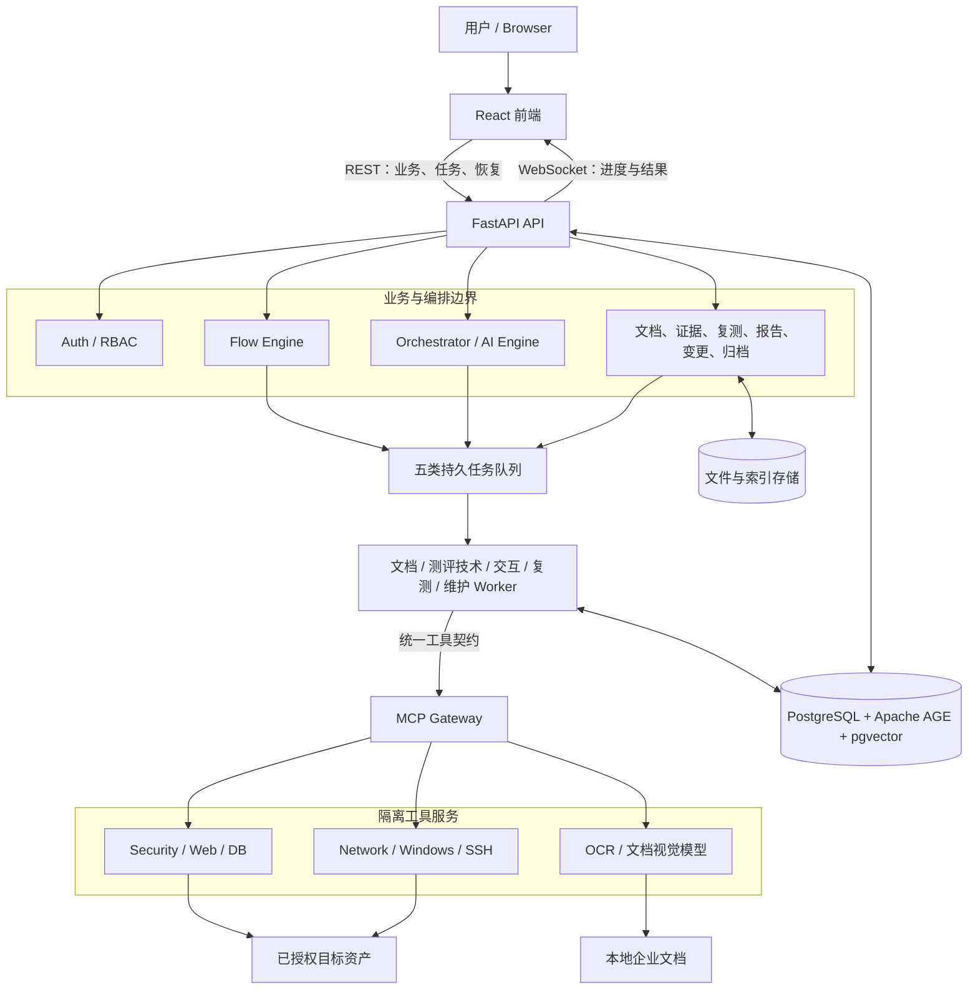

边界规则：
- API 负责授权和创建持久化意图，不在请求生命周期内等待长扫描完成。
- Worker 负责长任务执行；任务状态、进度和结果必须写入数据库，前端内存不是事实源。
- MCP Gateway 只负责工具路由、健康和统一调用，不负责项目权限或业务结论。
- Tool Server 返回真实工具结果和错误事实，不直接决定等保合规结论。
- LLM 可以理解指令和证据，但目标范围、权限、检查标准和最终规则结论由确定性代码约束。

Flow Engine 不并入 Orchestrator 或 AI Engine。三者协作但所有权不同：

| 模块 | 权威职责 | 不能负责 |
|------|----------|----------|
| Flow Engine | 四阶段、阶段依赖、任务状态机、进度、重置、事件和审计事实 | 自然语言理解、自由生成流程状态 |
| Orchestrator | 接收入口请求、组合上下文、编排 Skill/能力、聚合异步结果 | 绕过 Flow Engine 直接改测评状态 |
| AI Engine | 把自然语言转换为受约束的结构化计划和参数 | 决定权限、资产范围、最终合规结论 |
| Execution Engine / Worker | 领取持久任务，执行工具或文档流水线并回写结果 | 定义四阶段业务规则 |

集成方式是“Orchestrator 调用 Flow Engine 的命令，Flow Engine 把需执行任务交给 Worker，执行结果再由 Flow Engine 推进状态”。保持独立可以让暂停、重启、重置和审计不依赖 LLM 输出，并避免对话层故障破坏测评事实。

### 2.4 数据与存储职责

| 存储 | 保存内容 | 生命周期 |
|------|----------|----------|
| PostgreSQL | 用户、组织、角色、项目、资产、测评、任务、Finding、证据、复测、快照、归档、报告元数据及文档内容块 | 业务事实源，按权限和删除规则持久化 |
| Redis | 短期缓存、队列协调和临时状态 | 可重建，不作为最终结果唯一来源 |
| 文件存储 | 上传原文、证据附件、需保留的解析附件和版本化 HTML 报告 | 报告与 JSON 快照、哈希和版本元数据关联；跟随项目删除策略清理 |
| pgvector | 当前有效文档内容块的 1024 维语义向量和 HNSW 索引 | 嵌入、精确/向量混合召回和替换清理均为 `implemented`；可由内容块重建 |
| Apache AGE 标准图谱 | 标准、文档类型、检查项、证据要求、判断规则和整改建议 | 引擎、版本记录和 10 类/80 必检点入图 `implemented`；全局保护、版本化、项目清理不可删除 |
| Apache AGE 证据图谱 | 文件、内容块与检查项的支持、部分支持或矛盾关系 | 文档流水线自动同步、文件替换和项目/组织清理均为 `implemented` |
| 日志 | 服务健康、任务链路、工具错误和审计事件 | 脱敏并按运维保留期轮转 |

Apache AGE 是 PostgreSQL 的属性图扩展，也就是本系统实际使用的图谱引擎，不是前端图谱组件。它用节点和关系表达“标准版本 → 文档类别 → 检查项 → 证据要求 → 判断规则 → 整改建议”以及“项目文件 → 内容块 → 支持/矛盾检查项”。选择 AGE 是为了与业务表、pgvector、事务、权限、备份和高可用共用 PostgreSQL，同时使用 Apache License 2.0，避免额外部署和授权商业图数据库。关系事实放 AGE，敏感原文和业务状态仍留在 PostgreSQL，语义相似度仍由 pgvector 负责。

核心所有权：Project 是业务隔离边界，Organization 是权限隔离边界，Assessment 是测评状态边界，ScanTask/DocumentRun 是异步执行边界，Finding 是整改闭环起点，Evidence 是所有结论的追溯依据。

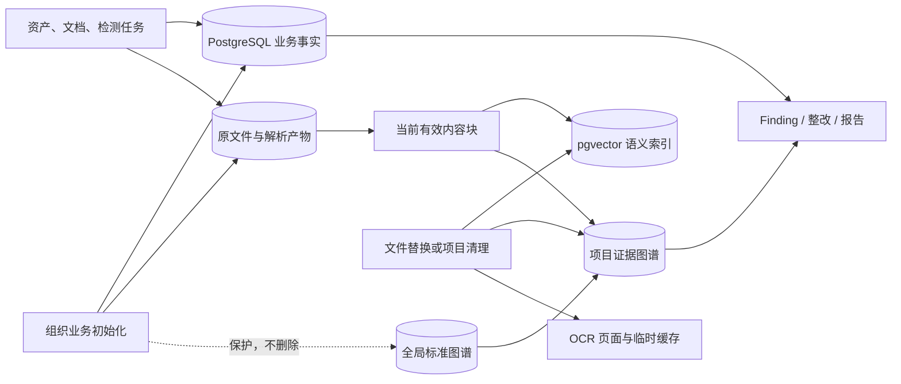

### 2.5 容器部署与可复现构建

- Git 仓库保存完整源码、锁文件、Dockerfile、Compose 编排、迁移和标准库；不依赖本机生成且被忽略的 `frontend/dist`。
- 前端镜像采用多阶段构建：Node 20 容器执行 `npm ci` 和 Vite 构建，再把静态产物复制到轻量 Python 静态服务镜像。
- 全新部署先由 `.env.example` 创建根目录 `.env`，并必须替换数据库密码和至少 32 位的 `SECRET_KEY`。
- `docker compose up -d --build` 是标准启动入口；`migrate` 服务先完成数据库迁移、pgvector/Apache AGE 初始化和标准图谱装载，业务服务再启动。
- PostgreSQL、Redis、上传材料、OCR 模型和向量模型分别使用持久卷；普通 `down` 不删除数据，只有明确清库时才使用 `down -v`。
- 模型权重不进入 Git。向量模型和 OCR/视觉模型首次使用时从模型源下载到持久卷，后续启动复用缓存。
- 可复现构建仍依赖部署环境能够访问 Docker 镜像源、npm/Python 软件源和首次模型下载源；这些外部网络失败必须与源码构建失败区分显示。
- `acceptance` Compose profile 提供隔离的受控 SSH/HTTP/HTTPS 靶机，用真实端口、认证、协议和漏洞工具结果验收完整流程；它不属于生产服务，也不替代已授权公网抽样。

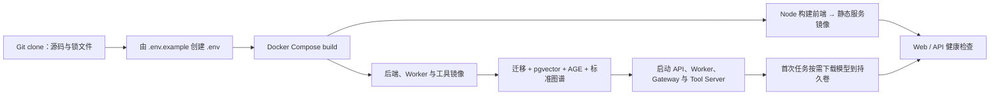

## 三、信息架构

产品主线按“组织 → 项目 → 资产/文档/检测 → Finding → 直接整改与复测 → 报告”组织。

```text
组织
  ├── Dashboard：整体态势、项目矩阵、风险队列、工具遥测、权限概览
  ├── 项目
  │   ├── 资产：IP、域名、云资源、授权范围、服务暴露
  │   ├── 等保自查：4 阶段流程
  │   ├── AI 对话：自然语言、/ 命令
  │   ├── 工具结果：单资产/多资产聚合结果
  │   ├── 整改与复测：Finding、改进文档、技术复测、逐项结果
  │   └── 报告：HTML 报告
  ├── 资产矩阵：跨项目资产视图
  ├── 报告中心：项目报告列表
  └── 组织设置
      ├── 访问控制：成员、身份角色、权限模板、授权审计
      ├── 数据与生命周期：容量、清理边界、组织业务初始化
      └── 模型配置：LLM、OCR 和供应商
```

## 四、核心模块

### 4.1 登录、组织与权限

产品目标：
- 支持多组织、多成员协作。
- 通过组织身份和权限模板控制项目、资产、扫描、复测、报告和组织设置能力。
- 在 Dashboard、访问控制页和项目个人资料中展示真实有效权限，避免用户不知道“能做什么”。

核心功能：
- 登录、注册、Token 认证。
- `/settings/access` 统一管理组织成员、身份角色、权限模板和授权审计；返回目标是组织 Dashboard，不依赖某个项目。
- 基础身份固定为管理员、负责人、成员和只读。管理员始终拥有全部权限且不使用权限模板；其他身份使用默认权限或一个自定义权限模板。
- 系统权限模板只读；自定义模板可以创建、编辑、删除和分配。
- `/settings/data-lifecycle` 独立承载数据容量、三级清理边界和组织业务初始化，只有 `system:config` 权限可操作。
- 项目访问和操作权限校验。
- 关键操作保留审计记录。

### 4.2 组织态势 Dashboard

产品目标：
- 作为用户进入系统后的指挥台。
- 展示“项目整体进度、风险处置压力、资产暴露面、工具健康度、权限治理状态”。
- 不承载对话指令，避免与项目执行页重复。

核心功能：
- 项目测评进度矩阵：按项目展示 4 阶段进度、问题数量、复测状态和下一步动作。
- 资产暴露面拓扑：以组织、项目、资产组、资产、服务为节点展示暴露关系；所有节点共用右侧检查器，点击后分别展示组织汇总、项目口径、资产组构成、资产事实或端口服务证据，并可在资产、服务与项目汇总间切换。
- 拓扑风险统一使用“当前待处理”口径：只统计 `open/in_progress/reopened` 的严重、高危和中危 Finding，并排除仅表示检测链路未完成的占位 Finding；项目与组织同时展示全部待处理、可归属具体资产和未归属资产三组数字。
- 资产筛选固定分为严重/高风险、待关注、当前无待处理、未验证四个互斥状态；“当前无待处理”仅适用于已完成权属验证且有有效检测记录的无风险资产，“未验证”不得冒充安全。
- 风险处置队列：按状态筛选待确认、处理中、已闭环风险。
- 工具遥测：展示安全工具状态、可用性、最近执行情况。
- 角色与权限治理：只展示组织成员、身份和权限模板摘要，跳转到 `/settings/access` 完成管理。
- 组织导航中的“项目工作台”进入项目与资产页；不再设置与其同路由的“检测结果”。预留的“密码测评”只显示“下个版本更新，暂未开启”，在能力落地前不得跳转到其他页面。

### 4.3 项目与资产工作台

产品目标：
- 将项目管理和资产管理合并成一个高密度工作区。
- 支持项目多了、资产多了之后仍能筛选、查看、归档和进入项目执行。

核心功能：
- 创建、编辑、归档、恢复、删除项目。
- 一键创建演示项目，用模拟资产、文档、发现项、复测和报告验证完整流程。
- 资产矩阵：跨项目查看 IP、域名、云资源、风险、所属项目和授权状态。
- 资产增删改查。
- 资产授权范围确认，未确认资产不应被默认用于扫描。
- `/assets` 旧入口重定向到 `/projects?view=assets`。

### 4.4 项目执行页

产品目标：
- 项目内所有实操集中在一个页面完成。
- 宽屏页面采用约 88px 图标文字导航、约 332px 等保流程轨道、弹性中央 AI 对话工作区和约 560px 右侧测评详情面板；较窄桌面按断点收窄流程轨道与详情栏，空间不足时详情栏移到中央工作区下方，但对话不得被隐藏或阻塞。
- 中央区域保留最大可用对话空间，因为自然语言执行检测是核心体验。
- 右侧展示当前结果、评分解释、历史与报告，不再把合规分、流程进度和报告状态混在一起。

核心功能：
- AI 对话执行：用户可输入“对所有资产做 Web 扫描”等自然语言。
- 自然语言、可视化快捷指令和 `/` 命令共用同一工具目录与执行契约；三者是同一能力的智能规划、卡片选择和命令检索三种交互形态，不维护重复工具清单。
- 多任务并发：执行中的扫描不阻塞用户输入下一条指令。
- 历史输入：支持回车发送、方向键调出历史命令。
- 结果展示：单资产、多资产、组合工具统一为聚合结果卡。
- 任务恢复：刷新后恢复运行中/已完成任务状态。
- 执行状态卡在运行中默认展开，结束后折叠保留；点击卡头可查看步骤、资产进度、失败原因和控制动作。工具结果卡同样支持点击卡头展开详情，旧结果默认折叠，仅保留最新一条展开。
- 输入区保留材料上传、`/`、紧凑“快捷指令”、文本输入和发送，最大限度把垂直空间留给对话与任务结果；`/` 打开可检索命令面板，“快捷指令”打开按工具目录生成的紧凑卡片面板，两者互斥显示并回到同一资产选择与执行链路。
- 左侧等保流程轨道直接展示四阶段、每阶段真实任务完成数、状态和总进度；当前或选中阶段展开为子步骤与“查看与执行”入口，点击阶段继续使用完整操作抽屉。阶段完成度表示本轮流程是否执行完毕，待处理问题数量独立展示，不用问题处置比例回算阶段完成度；合规分由检查点结论规则独立计算。整体、阶段和单项重置仍保留；项目创建留在 `/projects`，当前项目资产在项目设置中查看和维护，跨项目资产清单留在 `/projects?view=assets`。
- 中央历史长扫描文本折叠为“执行摘要”，用户可按需展开原文；新任务、进度卡和结构化结果仍在对话流内独立返回，不用大段原始文本淹没主要工作区。
- 左侧等保流程轨道与右侧测评详情面板可分别收起和展开；任一面板的状态不得改变另一面板。收起后只保留带 Tooltip 的图标把手，不把标题压缩成竖排文字。
- 右侧测评详情面板提供三个固定页签：当前结果、评分解释、历史与报告。
- 当前结果从持久化扫描、复测和 Finding 读取工具状态、全部、待处理、已修复和无法完成；四个问题状态及标题都可打开独立“问题与复测”详情，并自动应用相应筛选。
- 评分解释展示当前合规分、可靠覆盖率、可靠检查数、无法验证数、不适用数和扣分口径；流程进度不冒充评分。
- 历史与报告读取版本化 `ReportArtifact`，显示真实版本趋势、版本状态、生成时间、评分、覆盖率、待处理数、过期原因和当前评分口径，并支持预览、下载和版本对比；不足两个版本时明确提示，不生成模拟趋势。
- 项目页头使用有厚度边缘的 3D 水平往返翻转徽标，不得退化为二维顺时针旋转；对话消息头像和低透明中央水印保持静止，避免持续动画干扰阅读。顶部指标固定在 64px 页头内垂直居中，不得被裁切。
- 项目级主导航只展示已经可用的总览、项目、资产、测评、结果、报告和项目设置，不放置组织级访问控制入口，也不显示只会弹占位提示的未完成模块。
- 流程轨道中的完成度、合规分和待处理问题是三个独立事实；待处理数量使用稳定的单行徽标展示，不参与阶段完成度计算。
- Dashboard、项目/资产、检测记录、检测详情、模型设置、组织权限和报告中心使用项目工作台同源的深色网格根背景；页面内容结构、卡片和登录页保持各自设计。项目执行页的大面积面板不使用高开销背景模糊，独立滚动区保持稳定合成层，后台轮询返回等值数据时不得触发整页状态更新。
- 头像菜单中的个人资料展示真实账户、邮箱、组织身份和有效权限清单；“设置”进入模型与系统设置页。项目设置在内容区顶部固定提供醒目的“返回项目对话”；模型设置从组织导航返回 Dashboard。返回项目时优先选择最近一次实际有效项目，失效项目 URL 自动纠正到实际项目，不能让地址栏项目 ID 与页面内容不一致。

### 4.5 4 阶段等保自查流程

CertiProof 当前正式流程为：

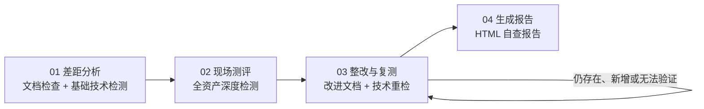

| 阶段 | 产品目标 | 主要内容 |
|------|----------|----------|
| 差距分析 | 快速识别初始不符合项 | 10 个核心文档检查，基础技术检测，生成初始 Finding |
| 现场测评 | 执行更完整的自动化检测 | 全资产组合扫描、Web 深度扫描、数据库、SNMP、Windows/AD、SSH 基线等 |
| 整改与复测 | 直接验证问题是否已改善 | 文档整类重新分析、技术问题按资产/能力复测、前后对比、逐项结果 |
| 生成报告 | 输出企业自查结果 | HTML 报告，包含问题清单、状态、时长、时间线和变更提示 |

流程要求：
- 支持整体重置、阶段重置、子项重置。
- 完全重置先停止当前项目的运行任务，再永久删除该项目全部测评派生数据和文件；项目、资产、成员权限、计划配置、标准库、标准图谱及审计日志保留。
- 单项重置清理该任务及其派生结论；阶段重置同时清理该阶段及所有下游阶段，避免保留失效报告。
- 已完成任务的普通“重新执行”不是重置：它只生成新的执行记录并更新当前检测事实，必须保留已修复问题和既有复测时间线。
- 正式阶段不能跳过或跨阶段执行；正式任务只有系统确认“不适用”时才能标记 N/A。
- 手动激活阶段也必须校验全部前序阶段已完成；报告生成前再次校验差距分析、现场测评和整改复测状态，不能依赖曾经写入的完成标记绕过门禁。
- 启动迁移和进度校准会把越级保存为 active/completed 的下游阶段恢复为 pending，同时保留已执行任务结果，待前序阶段完成后再按真实结果推进。
- 流程 100% 只表示四阶段任务均已处理，不表示全部合规；合规分、活动问题和无法验证项必须独立展示。
- 总体测评进度取四个阶段真实进度的平均值，阶段未全部完成时也能反映已执行工作；`completed_phases` 仍单独表示完整结束的阶段数。
- 合规分按可可靠判定的检查点计算：文档取每个任务/检查点的最新结论，技术检测按正式任务及稳定 Finding 归并；`pass/fixed` 计满分、`partial` 计半分、活动问题计 0 分。
- `failed/unable/not_tested` 按 0 分进入适用检查分母并降低合规分与可靠检测覆盖率；明确 `not_applicable` 的任务完全排除，多资产任务仅在所有资产均不适用时排除；`todo/in_progress` 不提前计分，仍有未完成正式任务时合规分保持未出具状态。项目与测评记录保存同一位小数精度，页面同时展示合规分、可靠检测覆盖率、无法判定数量和不适用数量。
- 测评完成页必须根据活动问题和覆盖率显示“全部修复、仍有待处理、存在无法验证项”等状态，并可展开查看处理汇总和每次重新检查运行，不允许出现空白阶段详情。
- “系统定级、备案”等旧模板阶段不再作为正式流程展示。

### 4.6 文档合规检查

产品目标：
- 对批量上传的企业材料做自动归类、取证和合规判断。
- 支持多文件共同提供证据。
- 输出能追溯到文件、页码、段落、表格或图片文字的证据。
- 文件名不规范只提示，不阻止内容分析。

> 状态：`implemented`。新文档子系统已经完整替换旧文档检查数据和算法，运行时只使用本节定义的内容块、标准图谱、混合检索、结构化判证和规则裁决链路。

处理链路：

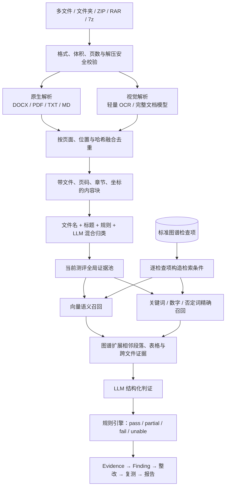

内容解析：
- 支持 DOCX、PDF、TXT、MD、常见图片以及安全解压后的批量材料。
- DOCX 提取段落、表格、页眉页脚、列表和内嵌图片文字。
- PDF 提取原生文本、页码、坐标和阅读顺序；扫描件或复杂版式调用 OCR/视觉模型。
- 原生解析与视觉结果自动补充和交叉验证；重复内容合并，冲突内容保留来源及置信度。
- 每个内容块记录文件、页码、章节、类型、坐标、正文、表格、来源、置信度和内容哈希。
- PDF/OCR 超时、服务暂时不可用和连接中断等瞬时错误按文件最多尝试 3 次，并显示当前尝试次数；文件损坏、格式不支持等确定性错误不重试。
- 必需文档未提供，或文件名可以可靠归类但三次仍无法提取正文时，该文档任务必须形成 `unable/not_tested` 结果和 Finding，不能静默遗漏或永久停留在待执行。

标准与证据架构：
- 10 类核心文档至少包含 80 个必检点，每项包含标准依据、必需证据、通过条件、缺失条件、严重程度和整改建议。
- 正式知识图谱是运行时标准库；YAML 只用于初始化、版本控制、导入导出和灾难恢复。
- 图谱引擎采用 Apache AGE，不使用 Neo4j Enterprise/Aura 等商业授权能力。AGE 使用 Apache License 2.0，并与 PostgreSQL 的事务、权限、备份和高可用体系共用同一数据底座。
- PostgreSQL 保存业务事实和带位置内容块，对象存储保存原文件和解析产物，pgvector 保存当前有效内容块的语义索引；图谱节点只保存业务 ID、哈希和关系，不复制整篇敏感原文。
- 标准图谱保存“标准、文档类型、检查项、证据要求、判断规则、整改建议”关系；证据图谱保存“文件、章节、内容块、检查项、支持/部分支持/矛盾”关系。
- 向量检索负责语义召回，关键词检索负责数字、时限、标准编号和否定词，图谱负责补充相邻段落、表格和跨文件关系。
- LLM 只根据检查标准和候选原文输出结构化证据判断，不能自行创造标准或直接决定总分。
- 结论只有 `pass`、`partial`、`fail`、`unable` 四类；提取失败或模型不可用时必须是 `unable`，不能算通过。
- 同一个文档类问题在证据与整改中归并展示，可展开查看不同检查点。

首批标准库范围：

| 文档类别 | 最低检查重点 |
|----------|--------------|
| 信息安全管理制度 | 适用范围、管理原则、职责、制度生命周期、监督与违规处理 |
| 信息安全管理机构设置文件 | 组织架构、负责人、岗位职责、授权关系、沟通与汇报机制 |
| 人员安全管理制度 | 入职、在岗、调岗、离职、培训、保密、账号与权限回收 |
| 安全建设管理制度 | 需求、方案、开发、测试、上线、外包、验收和变更控制 |
| 安全运维管理制度 | 日常运维、访问控制、介质、备份、恶意代码、变更和应急处置 |
| 信息安全事件应急预案 | 事件分级、组织职责、报告、响应、恢复、演练和复盘 |
| 安全事件管理制度 | 发现、登记、升级、调查、处置、证据保存和关闭机制 |
| 安全审计管理制度 | 审计范围、日志内容、留存、保护、审阅、告警和责任分离 |
| 系统安全方案 | 系统边界、资产、网络、主机、应用、数据、安全控制和实施路线 |
| 信息安全策略文件 | 安全目标、治理原则、风险偏好、责任、例外、评审和发布机制 |

图谱核心实体和关系：

| 类型 | 核心实体/关系 | 作用 |
|------|---------------|------|
| 标准实体 | StandardEdition、DocumentType、Control、EvidenceRequirement、DecisionRule、RemediationGuidance | 定义检查依据和最终裁决条件 |
| 内容实体 | Document、Page、Section、Block、Table、ImageText | 保存文档结构和可定位原文 |
| 业务实体 | Organization、Project、Assessment、DocumentRun、Finding、VerificationRun/Item | 连接文档分析与产品闭环 |
| 结构关系 | CONTAINS、NEXT、CHILD_OF、REFERENCES | 扩展相邻段落、表格和跨文件上下文 |
| 判证关系 | SUPPORTS、PARTIALLY_SUPPORTS、CONTRADICTS、MISSING_FOR | 保存检查项与证据之间的可解释关系 |
| 闭环关系 | PRODUCES、REMEDIATED_BY、RETESTED_BY、RESOLVES | 连接结论、整改动作和复测结果 |

数据生命周期：
- 文件和内容块使用 SHA-256 去重，相同内容不重复解析和嵌入。
- 只为当前有效材料保留在线向量；临时 OCR 页面、失败任务和可重建缓存自动清理。
- 图谱只保存有效实体、结构和证据关系，不保存全部临时候选结果。
- 提供重置本次测评、清空项目文档数据、初始化组织业务数据三级清理能力，标准图谱独立保护。

实现验收：`check_document_hybrid_retrieval.py` 使用真实 1024 维嵌入验证精确与向量混合召回；`check_full_mvp_flow.py` 使用真实文档分析完成初检、11 个差距、整改材料复测、0.94 改善值和 HTML 报告；`check_data_lifecycle.py` 验证文件、内容块、向量、扫描结果、项目证据图谱和标准图谱的清理边界。

### 4.7 技术检测与工具执行

产品目标：
- 让用户用自然语言、可视化快捷指令或 `/` 命令触发稳定的安全检测。
- 多资产结果必须带资产归属，不让聊天窗口被大量零散消息刷屏。
- 工具失败时给出具体原因，而不是只显示“失败”。

当前工具能力：

| 类别 | 能力 |
|------|------|
| 端口与存活 | 高危端口、自定义端口、全端口、高速扫描、批量存活 |
| SSL/TLS | 证书、协议、套件、风险项检测 |
| 漏洞扫描 | nuclei 漏洞模板扫描 |
| Web 检测 | Nikto、目录爆破、Web 模糊测试、SQL 注入检测、Web 发现 |
| 弱口令 | SSH 等服务弱口令检测 |
| 数据库 | Redis、MySQL、MongoDB、Memcached、Oracle 综合检测 |
| 网络设备 | SNMP walk/get/bruteforce、网络设备检查 |
| Windows/AD/SMB | SMB 枚举、Windows/AD 安全检查 |
| 基线配置 | 自动识别系统后的 SSH/审计/服务/文件权限/MAC 等检查 |
| 组合扫描 | `/all`、`/tech` 等组合检测矩阵 |
| 诊断 | MCP Gateway、工具服务、二进制依赖、参数烟测 |

结果要求：
- 返回结构统一为 `status、target、capability、data、metadata、error`。
- 漏洞扫描必须在执行前验证目标至少一个候选服务端口能够建立 TCP 连接；仅有 nuclei 进程退出码 0、但无连通证据且无发现项时，结论必须是 `warning/无法验证`，不能显示“成功/未发现漏洞”。
- 多资产结果合并为一个聚合卡片，可按资产展开详情。
- 端口 filtered、timeout、connection refused、auth failed、missing credential 等要明确区分。
- 工具执行完成但无发现时，也要展示“检测了什么、覆盖了哪些资产、为什么无发现”。
- `ScanTask.status=completed` 只表示执行生命周期结束；结果必须继续区分“未发现问题、发现风险、部分完成、无法完成、不适用”。
- `ScanTask.status` 与 `control_state` 必须同步进入 running/completed/failed/cancelled；恢复、刷新和遥测不能把已结束任务继续显示为排队中。
- 组合任务全部子工具因服务未开放而跳过时结论为“不适用”，部分子工具失败时保留成功结果并显示“部分完成”，不得误报正常。
- SNMP 等协议工具无响应时返回失败或无法完成，并清理依赖库初始化噪声，不能以顶层成功包装空结果。
- 项目页工具遥测从持久化 ScanTask 读取最近结果，不依赖聊天消息；刷新、切换页面或重启服务后结论仍可恢复。
- 复制按钮输出可读文本，不能出现 `[object Object]`。

### 4.8 证据、Finding 与整改复测

产品目标：
- 将文档检查和技术检测产生的问题统一进入整改闭环。
- 整改不是简单“标记已修复”，而是提交新证据或重新执行对应检测。

核心功能：
- 自动生成 Finding：来源包括文档检查、技术检测、资产/端口变更。
- 同类文档问题聚合展示，展开后查看不同检查点。
- 不建立虚假的工单系统；`Finding` 直接连接改进材料、技术复测和最终状态。
- 文档整改以该文档任务的当前有效多文件集合为边界；技术整改以资产、能力和稳定风险指纹为边界。
- `VerificationRun` 表示一次持久化复测，`VerificationItem` 保存每个 Finding 的初检观察、复测观察、前后对比和结论，`FindingEvent` 保存时间线。
- 复测结论为 `fixed`、`still_present`、`new`、`unable`、`cancelled`；只有 `fixed` 自动关闭 Finding。
- 网络、认证、参数、模型或工具条件不足时，Finding 保持待整改或无法验证；用户修正条件后重新检测，不能用管理性状态代替真实复测。
- 文档正文未可靠提取或模型未完成判证时，必须补充可解析材料、重新分析或恢复视觉/LLM 能力。
- 用户不能直接点击把问题改成通过；只有完整、可信的复测结果可以自动验证并关闭问题。
- 差距分析或现场测评中任何必检任务失败，都作为执行阻断项进入整改与复测工作区并阻止自动推进；用户仍可在没有运行中复测时选择“以当前结果生成报告”，报告必须把阻断原因和覆盖缺口原样披露。
- 同一个未完成检测如果已经生成 `not_tested` Finding，只计一次待处理问题，不能再叠加一个执行阻断项扩大整改分母。
- “整改与复测阶段已结束”和“问题复核进度”是两个指标：用户选择按当前事实出报告可以结束本轮阶段，但未复核、仍存在和无法验证数量必须原样保留。

#### 整改编排边界

Finding、文档/技术复测、自动裁决、阶段联动、重置清理和报告追溯已经按 5.10 节形成可信闭环。Orchestrator 后续可以增加整改建议编排，但只能调用 Verification、Flow Engine 和 Execution Engine 的公开命令，不能直接写数据库、手动把 Finding 改成通过、跳过复测或绕过权限。

| 能力 | 当前状态 |
|------|----------|
| Finding、复测运行、复测明细和时间线权威模型 | `implemented` |
| 文档/技术复测、阶段联动和自动裁决 | `implemented` |
| Orchestrator 调用整改建议与复测原子能力 | `accepted-pending` |

### 4.9 资产与端口变更检测

产品目标：
- 当资产或端口暴露面发生变化时，提示用户重新评估。

核心功能：
- 资产快照：记录项目资产增删改。
- 端口快照：基于端口扫描结果记录开放端口变化。
- 变化类型：新增资产、删除资产、新增端口、关闭端口。
- 变化提示：进入项目时展示需要重新评估的变化。
- 变化确认：用户确认后从待处理队列中移除。

### 4.10 报告中心

产品目标：
- 报告要能读懂，不只是任务流水。
- 默认输出 HTML 报告，适合预览、分享和归档。

报告内容：
- 项目概况、资产范围、测评阶段进度。
- 初次检测发现的问题。
- 文档检查结果和证据来源。
- 技术检测结果和资产归属。
- 整改状态、仍存在项、无法验证项和解决时长。
- 复测前后对比。
- 资产和端口变更提示。
- 风险和合规结论摘要。

生成门禁：差距分析、现场测评和整改与复测必须按顺序完成，且前两个阶段的正式任务都已进入可披露终态；仍为 `todo/in_progress` 的必检任务会阻止报告生成。`failed/cancelled` 可以作为无法完成或不适用进入报告，但不能伪装成通过。报告快照必须从当前事实重新计算阶段进度，不能把未完成的上游阶段强制写成 100%。

### 4.11 归档能力

产品目标：
- 项目完成后可以归档，减少工作区噪音，但保留可追溯资料。

核心功能：
- 项目归档后只读展示，允许查看结果和导出报告。
- 支持恢复归档项目。
- 归档应覆盖项目基本信息、资产、扫描结果、Finding、证据、整改、报告和对话摘要。
- 后续可增加压缩包导出：HTML 报告、结构化 JSON、证据索引和关键附件清单。

### 4.12 模型与 OCR 配置

产品目标：
- 允许根据部署环境切换文档解析策略，兼顾准确率、速度和容器兼容性。

配置分层：
- 原生解析优先：`python-docx + pypdf + pypdfium2`，不是 AI 模型，适合 DOCX 和文本型 PDF。
- 轻量 OCR fallback：`RapidOCR 1.4.4 + ONNX Runtime`，适合普通扫描件、图片或原生文本不足的页面。
- 完整文档视觉模型：`PaddleOCR-VL-1.6`，适合复杂版式、表格、图表、图片文字和深度交叉验证。

实际模型与用途：

| 组件 | 当前模型/运行时 | 用途 | 下载与加载 |
|------|-----------------|------|------------|
| 文档语义向量 | `intfloat/multilingual-e5-large`，FastEmbed + ONNX Runtime，1024 维 | 把检查项和内容块转为向量，做语义召回；不负责合规判定 | 首次使用下载到 Docker `embedding_models` 卷，之后复用缓存 |
| 轻量 OCR | `RapidOCR 1.4.4`，ONNX Runtime | 识别普通扫描页文字和坐标 | 随 OCR 镜像安装，按页面懒执行 |
| 完整视觉解析 | `PaddleOCR-VL-1.6`，默认 CPU | 解析版面、表格、图表标签和复杂页面 | 首次需要时懒加载到 `ocr_models` 卷；当前容器健康状态为 `lazy`，表示已配置但尚未加载 |
| 合规判证 LLM | 组织模型配置中为“文档判证”用途选择的模型，不固定供应商 | 只针对检查项和候选证据输出结构化支持/部分/不支持/矛盾 | 由模型配置管理；本地文档默认不发送给外部视觉服务 |

自动策略：标准模式仅对原生为空、单页文字少于阈值或包含关键图片的页面调用 OCR；先运行 RapidOCR，结果为空、平均置信度低于 0.72、要求视觉优先或选择深度模式时，再调用 PaddleOCR-VL-1.6。深度模式会对 PDF 页面进行交叉验证。两种结果按位置、哈希和相似度融合并保留来源置信度。Paddle 原生运行时被隔离在子进程中，即使发生段错误或超时，OCR API 仍存活。原生正文可靠或轻量 OCR 已覆盖全部必需图片时，完整视觉失败只显示降级警告并继续；原生不足且必需视觉页面未完整覆盖时才返回 `unable`，不得生成完整合规结论。

要求：
- 本地优先，不默认把企业文档发往外部视觉服务。
- 容器部署需能按环境选择后端模型。
- 模型不可用时返回 `unable`，不能默认为通过。

## 五、关键用户流程

本节是现行产品的操作级规格。`implemented` 表示当前代码和页面已经具备该主流程，`accepted-pending` 表示设计已经确认但仍需按本文完整替换或补齐。

### 5.1 企业自查主流程

**状态**：`implemented`，文档合规子流程已按 5.7 节落地。

前置条件：用户属于一个组织，已创建项目，并对需要检测的资产确认授权范围。

1. 用户登录后进入组织 Dashboard，先查看跨项目测评进度、风险、资产暴露面和工具状态。
2. 用户在项目与资产工作台创建项目，填写项目名称、等保等级和基本信息。
3. 用户录入 IP、域名或云资源，并逐项确认资产属于本组织且允许执行安全检测。
4. 系统为项目初始化唯一的四阶段测评实例及正式任务矩阵。
5. 差距分析阶段分为“文档合规”和“基础技术检测”两条轨道；用户可以自动批量执行，也可以展开后手动执行单项。
6. 每项完成后产生可追溯证据；不符合项生成 Finding，失败或条件不足显示为未完成，不能算通过。
7. 现场测评对全部授权资产执行更完整的工具矩阵，允许单个资产或子工具失败，整体保留完整结果。
8. 整改与复测阶段按文档任务或技术来源聚合问题；用户既可在单个文档组内替换/补充材料，也可批量提交文件、文件夹、ZIP、RAR 或 7z。批量材料先自动归类，同类旧版本停用并保留审计，新版本随后重新检查该类全部未解决问题；技术问题按原资产和能力重新执行检测。
9. 系统比较初检和复测结果，生成已修复、仍存在、新增、无法验证或已停止结论；未解决项继续留在本阶段。
10. 当全部 Finding 都获得一次真实终态复核结论、没有活动复测且没有仍为 `failed` 的必检任务时，报告阶段自动开启；`still_present/new/unable` 继续保持活动问题并进入报告，不能伪装成已修复。
11. 用户也可以在没有运行中复测时选择“以当前结果生成报告”。该动作结束本轮整改、保存当前问题快照并激活报告，但不会关闭尚未复核、仍存在、无法验证或执行阻断的问题；它们必须作为覆盖限制写入报告。之后再次发起复测会使该报告状态失效并重新打开整改阶段。
12. 生成报告阶段基于当前项目事实生成 HTML 报告，涵盖资产、证据、问题和复测结果。
13. 项目完成后可归档为只读；需要继续工作时恢复项目，不复制项目数据。

核心数据流：`Organization → Project → Asset/Assessment → Evidence/ScanTask → Finding → VerificationRun/Item → HTML Report`。

验收要求：从空项目开始，不直接修改数据库，能够完成一次“发现问题、整改、复测、生成报告”的闭环。

### 5.2 注册、登录、组织与角色权限

**状态**：`implemented`。

1. 注册时校验邮箱和用户名唯一性，创建用户、组织及组织成员关系，注册用户成为组织管理员。
2. 登录时校验密码和账号启用状态，签发访问令牌与刷新令牌，并返回用户所属组织。
3. 前端保存当前用户和组织上下文；访问受保护路由前必须具有有效登录态。
4. 后端先解析成员的基础身份：管理员、负责人、成员或只读。管理员始终解析为全部权限且忽略历史权限模板；其他身份在已分配自定义模板时以模板权限为准，否则使用该身份的默认权限。
5. `/settings/access` 按项目、资产、扫描、测评、报告、RBAC、系统七组展示权限；拥有 `role:read` 的成员可查看，拥有 `role:manage` 或 `member:manage` 的成员分别管理模板或成员。
6. 管理员可以创建自定义权限模板、选择权限、分配成员并查看授权审计。系统模板不可编辑，自定义模板只接受权限目录中存在的权限标识。
7. 成员授权明确区分“基础身份”和“权限模板”；管理员不能绑定模板，非管理员可以不绑定模板并使用身份默认权限。
8. 后端禁止成员移除自己、禁止删除或降级最后一名管理员、禁止非管理员授予管理员身份；历史管理员模板关联由迁移 `022` 清理。
9. Dashboard 只返回当前用户有权读取的 RBAC 摘要；没有 `role:read` 时不泄露成员、模板和审计内容。
10. API 对读取、创建、修改、删除、执行扫描、管理测评、导出报告和系统配置分别做权限判断，前端隐藏入口不能替代后端校验。

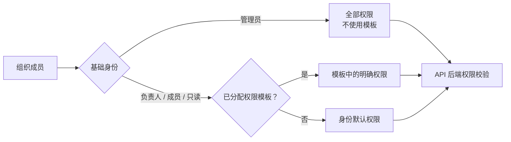

异常规则：未登录返回认证错误；不属于组织或缺少权限返回明确的 403；禁用账号不能登录；角色名称冲突不能覆盖已有角色；系统模板不得修改；未知权限、最后管理员降级和自我移除均被拒绝。

验收要求：使用只读身份读取项目和报告成功，但访问成员清单、执行扫描、初始化组织数据或修改权限必须失败；管理员始终拥有全部权限。

### 5.3 组织 Dashboard

**状态**：`implemented`。

1. 用户选定组织后进入 `/dashboard`，后端按组织范围聚合项目、资产、Finding、扫描任务、测评和角色数据。
2. 项目测评进度矩阵按项目展示四阶段完成度、问题数、复测状态和下一步动作；百分比直接读取最新 Assessment 中由 Flow Engine 持久化的 `progress`，并与具体项目页显示同一数值，不再使用 Dashboard 自己计算的任务完成率。
3. 资产暴露面拓扑按“组织、项目、资产组、资产、服务”构图；资产和端口增多时仍以真实关系连线，不把项目或资产伪装成风险节点。超过 24 个资产时按资产类型折叠为资产组，用户可先查看组级统计再展开。
4. 组织、项目、资产组、资产和服务节点共用统一检查器。项目检查器同时展示全部待处理、资产归属风险和未归属资产；资产检查器展示名称和地址、类型、所属项目、纳管状态、权属验证、风险结论、最近检测和开放服务；服务检查器展示来源资产、端口、协议和最近观测时间。“查看项目汇总”必须切换到真实项目检查器，而不是执行无效跳转。
5. 待处理风险只统计活动状态的严重、高危和中危 Finding，并排除“检测未完成（不代表通过）”占位项。资产归属风险是其中可通过 `ScanTask.asset_id` 追溯到具体资产的子集，未归属资产等于两者差值；风险列表完整返回当前节点范围内的全部可归属风险，并在固定高度区域内滚动，不做静默截断。
6. 资产状态是互斥分区：严重/高风险、待关注、当前无待处理、未验证。已验证且已有有效检测记录、同时不存在待处理风险时才进入“当前无待处理”；无风险但未验证或没有检测记录时进入“未验证”。
7. 服务节点读取该资产最近一次包含明确开放端口证据的扫描结果；资产“最近检测”仍读取最近任务，两者不得因后续非端口扫描相互覆盖。
8. 风险处置队列展示可识别的问题标题、资产、来源工具、严重程度和状态，不使用笼统的“自动化技术检测”代替真实来源。
9. 工具遥测展示不同工具图标、名称、健康状态、最近执行时间和成功失败情况，不要求用户点击后才知道工具名称。
10. 角色与权限治理展示成员、身份和权限模板数量，并进入 `/settings/access` 继续管理；数据初始化不放在该区域。

交互规则：Dashboard 不提供聊天命令；拓扑、风险、工具和角色区域必须可滚动或伸缩；空数据展示明确空状态；任一聚合接口失败时局部降级，不应使整个 Dashboard 空白。

### 5.4 项目与资产生命周期

**状态**：`implemented`。

1. 用户只在 `/projects` 创建项目，具体项目执行页不出现重复创建入口。
2. 创建项目后记录所属组织、创建人、等保等级和项目状态；演示项目通过单独入口生成完整模拟链路。
3. 用户在当前项目设置中新增 IP、域名或云资源；资产表同时展示资产类型、资产值、名称、所属项目和验证状态。跨项目资产视图只负责组织范围检索与汇总，系统校验格式并保存项目归属和资产信息。
4. 资产执行检测前必须确认授权范围；未确认资产可以管理和查看，但不能被“所有资产”默认扫描。
5. 项目执行页和 AI 编排只能从当前项目的已授权资产集合解析“全部资产”，不能注入其他项目或历史对话中的地址。
6. `/assets` 只作为兼容路由重定向到 `/projects?view=assets`，产品信息架构中不保留第二套资产页面。
7. 项目归档后从活动项目列表移出并进入只读状态；恢复后回到活动工作区。
8. 删除资产或项目必须删除其业务关联数据，并清理对应文件和可重建索引；不能只删除前端列表项。

异常规则：重复资产应归并或提示，不能在一次多资产任务中重复执行；域名解析失败必须显示 DNS 或连接原因；资产越权、格式错误或未确认授权时应在创建任务前失败。

### 5.5 测评初始化、状态推进与重置

**状态**：`implemented`。

1. 新建测评时只创建四个阶段：差距分析、现场测评、整改与复测、生成报告。
2. 二级和三级共用四阶段骨架；三级现场测评额外包含网络设备和 Windows/AD/SMB 检测。
3. 测评状态为 `not_started → in_progress → paused/completed`；阶段状态为 `pending/active/completed/failed`；任务状态为 `todo/in_progress/completed/failed/cancelled`。
4. 启动测评后激活首个满足依赖的阶段；真实执行结果更新任务和执行覆盖率，全部正式任务到达终态后才进入下一阶段。
5. 任意阶段的激活都重新校验全部前序阶段，不仅依赖模板中的 `depends_on`；旧数据或手动调用也不能跨阶段。
6. 自动任务失败时保留失败结果，不自动把阶段内其他未完成任务标为通过；用户可以修正条件后重新执行。
7. 支持暂停和继续测评；继续只恢复状态，不清空证据。
8. 单项重置把对应任务恢复为 `todo`，清除该任务结果和由该任务派生的 Evidence、Finding、Verification 数据；文档任务同时清理关联文档分析产物。
9. 已完成任务的普通重新执行使用非破坏性重跑：允许任务再次进入执行态，但不删除已修复 Finding、VerificationRun/Item 和下游报告历史；新结果通过稳定风险指纹更新当前事实。
10. 阶段重置清空该阶段及所有下游阶段的任务、Finding、复测和当前报告输出；已有报告版本标记过期，避免继续引用失效的上游事实。
11. 完全重置先将当前项目的扫描、文档分析、复测和正式任务置为取消，再把四阶段及任务恢复到初始状态；Worker 后续返回不得重新写回已删除结果。
12. 完全重置永久删除该项目的 ScanTask/ScanHistory、ChangeSnapshot、ResultCache、ActionHistory、Evidence、Finding、Verification、文档原件与分析运行、内容块与向量、项目证据图谱、全部 HTML 报告版本及其物理文件；合规分归空，对话文本保留但旧结果卡标记为已重置。
13. 完全重置不删除 Project、Asset、组织成员与权限、ScheduledScan 配置、全局标准库/标准图谱和追加式 AuditEvent；其他项目的数据必须保持不变。
14. 四个正式阶段不能跳过或跨越；任务只有自动适用性判断得到明确“不适用”时才能进入 `cancelled/N/A`。
15. 自动化检查结果只能由 Worker/执行器写入，页面和通用 API 不提供人工“完成”旁路。
16. 一个项目只保留一个当前测评实例；创建命令先锁定 Project 行并复用已有实例，避免页面并发初始化产生两套阶段。所有“最新测评”查询按 `created_at DESC, id DESC` 稳定排序。
17. 测评进度只由 Flow Engine 在任务、阶段、复测、重置和报告等写操作后重新汇总并持久化；测评详情、整改工作区和 Dashboard 的 GET 查询必须保持只读，不能因轮询或刷新改变阶段。
18. 项目页在测评或阶段运行期间每 5 秒读取持久化状态，刷新或重新进入后继续恢复同一进度。测评任务重跑、测评材料上传/重分析、整改复测、阶段重开或重置属于正式测评写入，可以重新打开阶段并改变进度；聊天、`/`、快捷指令、扫描 API 和定时监控产生的独立检测记录不得改变当前测评进度、评分或报告状态。

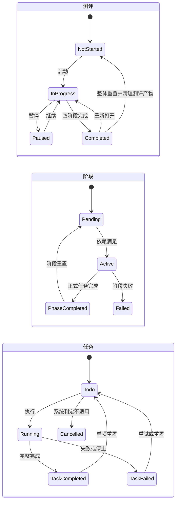

UI要求：整体、阶段和单项都要有可见重置入口；危险操作明确显示影响范围并二次确认；完成后立即刷新进度与证据整改区，不能残留旧卡片。

### 5.6 差距分析自动与手动执行

**状态**：`implemented`，文档分析内核已按 5.7 节替换。

1. 差距分析页面将“文档合规检查”和“基础技术检测”分成两个清晰区域，不混排二十余个任务。
2. 文档区域支持一次上传多份材料或压缩包并自动分派到相关检查任务；仍保留单个文档任务的上传、分析和重置入口。
3. 基础技术区域执行前先收集一次通用认证信息，包括用户名、密码或密钥及必要端口；凭据只进入本次授权执行参数，不显示在结果、日志或文档中。
4. 点击自动执行后，对全部已授权资产依次创建高危端口、漏洞、配置/基线、弱口令和 SSL/TLS 五类任务。
5. 可并行的资产和能力按并发限制执行；需要 SSH 的任务按资产使用凭据，不支持的域名或连接条件不足返回跳过或失败原因。
6. 每个子任务持续更新等待、运行、完成、警告、失败或跳过状态；基础检测整体展示资产数、成功数、未完成数和风险数。
7. 只有工具完整执行且检查结果满足要求时才可通过；错误凭据、连接超时、工具不可用和参数缺失均属于“未完成检测”，不能显示为安全或通过。
8. 用户可在自动执行后单独重跑失败项，也可从一开始手动执行某个任务。
9. 技术风险生成 Finding；无风险结果保留检测范围和无发现说明；未完成结果只生成待处理提示，不虚构风险也不关闭旧 Finding。

验收要求：故意输入错误 SSH 密码时，端口扫描等无需凭据的任务可正常完成，基线任务明确显示认证失败，差距分析整体显示“部分未完成”。

### 5.7 批量文档合规检查

**状态**：`implemented`，已完整替换旧文档检查实现，不迁移旧文档数据或保留旧算法分支。

输入与限制：支持多文件、文件夹、ZIP、RAR、7z；MVP 文档格式为 DOCX、PDF、TXT、MD 和常见图片；单文件上限 100MB，单批默认最多 200 页。加密、分卷、嵌套压缩包和旧 DOC 明确拒绝或提示转换，不能静默跳过。

1. 上传接口先校验权限、项目、测评任务、文件类型、体积、页数和压缩包安全，随后立即创建异步分析任务并返回任务 ID。
2. 文件存储服务保存原文件，计算文件 SHA-256；相同文件不重复保存、解析和嵌入。
3. DOCX 原生解析段落、标题、列表、表格、页眉页脚和内嵌图片；PDF 原生解析文字层、页码、坐标和阅读顺序；TXT、MD 直接解析。
4. 原生内容为空、字符质量异常、表格顺序混乱、页面含关键图片或用户选择深度模式时，调用轻量 OCR 或完整文档视觉模型补充。
5. 融合器按页面位置、文本哈希和相似度合并内容；原生结果优先，视觉结果补缺，冲突内容同时保留来源和置信度。
6. 每个内容块保存项目、测评、文件、页码、章节、块序号、类型、坐标、原文、表格结构、解析来源、置信度和内容哈希。
7. 分类器根据文件名、文档标题、结构规则和 LLM 内容判断生成一个或多个候选类别；命名不规范只产生 `filename_warning`，不会阻止分析；无法分类的材料进入全局证据池。
8. 系统从标准图谱读取当前检查项的标准依据、必需证据、完整条件、否定条件、严重程度和整改建议。
9. 每个检查项先按项目、当前测评和有效文件过滤，再分别执行向量语义检索和关键词精确检索，通过合并排序得到候选块。
10. 证据图谱补充候选块的同章节相邻段落、关联表格、跨文件引用和已有证据关系，避免只截取一句话失去上下文。
11. LLM 接收单个检查项和少量候选原文，逐条件输出 `support/partial/unsupported/contradict`、理由、引用块和置信度；模型不能修改检查标准。
12. 规则引擎汇总必需条件：全部完整且无矛盾为 `pass`，有证据但不完整为 `partial`，可靠提取后缺失或矛盾为 `fail`，提取或模型不可用为 `unable`。
13. `partial/fail` 生成 Finding；每条结论保存到原文件、页码、章节、表格或图片文字的证据关系。
14. 前端持续显示上传、原生提取、视觉解析、融合、分类、标准检索、判证和结果生成进度；刷新后按任务 ID 恢复。
15. 文档运行状态统一为 `queued → running → completed/failed/cancelled`；批量归类和单项文档检查均可从页面停止，停止不是分析失败，也不能被迟到结果覆盖。
16. Worker 为运行记录写入执行者、心跳和 15 分钟滚动租约；进程中断后只领取租约过期任务，最多自动恢复 3 次，单次运行默认最长 240 分钟。
17. 每个文件提取、融合和嵌入完成后立即持久化内容块与进度；恢复同一运行时复用已完成文件，只继续未完成文件，不从首个文件重复 OCR。
18. 单文件内部的瞬时提取错误最多执行 3 次（首次 + 2 次重试），按 1 秒、2 秒退避，并在进度中显示第几次尝试；成功恢复记录 `recovered_after_retry`，三次失败记录最终原因和尝试次数。
19. 必需类别缺少材料，或可归类文件最终不可读时，任务进入 `failed/unable` 并生成 `not_tested` Finding；整改批次上传可读新版本后重新分析该类别。

失败与恢复：文件损坏或格式不支持时只影响对应文件且不做无意义重试；OCR 不可用但原生内容可靠时可继续，依赖视觉内容的检查项为 `unable`；LLM 不可用时不得用关键词命中直接判定通过。用户停止时 Worker 取消当前 OCR/模型等待并保留已完成文件；超时或 Worker 中断时保留检查点并自动恢复，达到恢复上限后明确失败，不能永久停在“正在提取”。

整改复测：上传整改材料后，以该任务当前有效文件集合重新分析受影响检查项；系统保存初检和复测结论快照用于对比，但不运行旧版数据结构或旧算法。新材料确认生效后清理被替换文件的在线向量和临时 OCR 产物。

验收要求：至少覆盖文本 DOCX、含表格 DOCX、文本 PDF、扫描 PDF、混合 PDF、图片、多文件共同取证、错误文件、OCR 关闭、命名不规范和相互矛盾证据。

### 5.8 技术工具与多资产执行

**状态**：`implemented`。

入口统一为项目页自然语言、可视化快捷指令、`/` 命令、测评任务和单项复测；所有入口必须解析到同一 Capability Registry 和参数契约。

1. 指令层识别能力、资产范围和参数；“全部资产”固定解析为当前项目已授权资产，不接受模型生成的项目外目标。
2. 执行策略校验当前角色的 `scan:execute` 权限、资产授权状态、工具风险级别和必需凭据。
3. 后端为任务创建持久化 ScanTask，状态从 `pending` 进入 `running`，前端立即显示运行卡片，输入框保持可用。
4. 多资产计划按“资产 × 能力”展开并去重；组合工具形成显式子任务矩阵，单个子工具失败不丢弃其他结果。
5. Execution Engine 统一能力别名和参数，按并发上限调度，通过 MCP Gateway 路由到对应 Tool Server。
6. Tool Server 执行真实二进制或协议检测，并返回原始结构；工具未安装、参数错误、网络不可达、端口拒绝、超时、认证失败和目标不适用必须区分。Gateway 可以增加友好说明，但必须保留原始目标和底层原因，不能用通用文案覆盖工具事实。
7. 执行层将每个结果归一化为 `status、target、capability、data、metadata、error`，组合结果增加子任务成功、警告、失败和跳过统计。
8. WebSocket 推送实时状态，轮询作为补充；完成事件必须携带完整结果。页面刷新后根据持久化任务恢复运行态或已完成结果。
9. 前端把同一命令的多资产结果聚合为一张可展开卡片；每个资产显示 IP/域名、资产名称、工具、覆盖内容、风险和错误。
10. TaskExecutor 只从完整成功结果生成或更新技术 Finding；关闭历史 Finding 必须走整改与复测链路，失败、警告或部分执行不能被解释为“未发现风险”。
11. 自动测评任务每 10 秒续租，租约默认 2 分钟；每个资产完成后立即写入 `asset_results` 检查点，Worker 恢复时跳过已完成资产，最多尝试 3 次。
12. 停止请求先以 `cancel_requested_at` 和 `execution.state=cancelled` 持久化，再由 Worker 取消本地协程；MCP Client 调用 Gateway 取消接口，Tool Server 终止 nmap、nuclei、hydra、testssl 的实际进程组或关闭 SSH 协程。
13. 完成与停止使用条件更新竞争：先成功写入的终态生效，迟到结果不能把 `cancelled/failed` 覆盖为 `completed`。
14. 每次状态变化同时更新 `ScanTask.status` 和 `control_state`；部署迁移统一修正既有任务中“已完成/失败但仍显示排队”的状态。
15. 自然语言、`/`、快捷指令和扫描 API 创建的任务统一标记为 `source=interactive`；定时监控标记为 `source=scheduled_monitoring`；正式测评技术任务标记为 `source=assessment_task`。
16. `interactive` 和 `scheduled_monitoring` 结果保留在检测记录、风险信息和端口变化提示中，但不重算当前测评分、不创建测评技术 Finding，也不使已生成报告过期。用户需要把新事实纳入正式结论时，必须从测评流程重新执行对应技术任务、整改复测或重新开始测评。

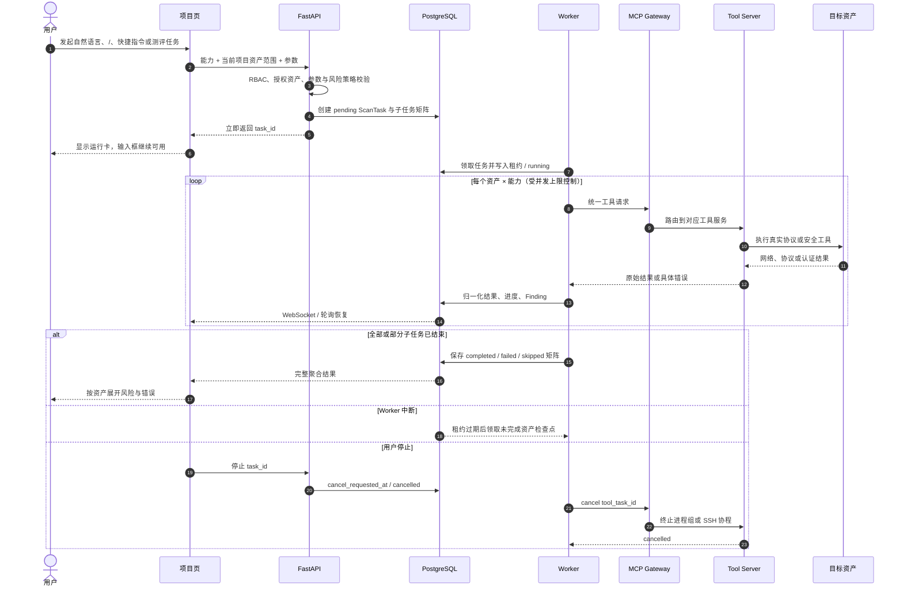

端口结果必须区分 `open`、`closed`、`filtered`、`unreachable`；SSH 端口扫描显示开放只代表 TCP 可建立，基线检查仍可能出现认证失败、连接拒绝或容器出口超时。SSL/Web/数据库等协议工具同样必须区分端口层可达和应用层握手成功。

错误结果必须包含：发生在哪个资产、哪个工具、执行到哪一步、底层原因、是否可以重试以及建议检查的网络、凭据或参数。复制结果时递归序列化对象和数组，不能出现 `[object Object]`。

顶层工具和组合子工具共用同一结果判定：`scan_completed=false`、`success=false`、`reachable=false` 或 `tool_status=warning` 必须归一化为 `warning`，界面统一显示短状态“无法判定”，并在独立摘要列展示工具原始原因；不得计入成功、不得生成“0 个问题”或“本次未发现问题”的安全结论。状态和风险标签禁止拆字换行，长原因允许自然换行或横向滚动，不能压缩成不可读文本。ScanTask 可以进入执行终态 `completed`，但结果可信度必须保持 `conditional`，相关 Finding 和复测项保持活动状态。

### 5.9 AI 对话、命令解析与并发任务

**状态**：五类对话边界、入口统一、持久化任务、进度恢复、多任务输入、独立 Worker 队列和受控并发均已 `implemented`；多 Agent 协作是 `accepted-pending`。

| 对话类别 | 支持范围 | 处理方式 |
|----------|----------|----------|
| `project_query` | 资产、合规状态、通过准备度、主要差距、管理层摘要、问题和既有检测事实 | LLM 识别语义，后端确定性查询和排版 |
| `detection_execution` | 端口、漏洞、Web、基线及能力目录中的其他安全工具 | LLM 生成受限 Capability 计划，代码校验后异步执行 |
| `flow_operation` | 开始测评、整改复测、重置、生成报告 | 映射为受权限和 Flow Engine 约束的显式命令 |
| `help` | 能做什么、如何上传、如何检测、如何理解结果 | 返回 CertiProof 当前能力和操作说明，不启动任务 |
| `out_of_scope` | 与项目查询、检测、流程和产品使用无关的问题 | 明确说明不支持，不退化为通用聊天助手 |

**分层 Prompt Skill 架构**：

1. AI Engine 常驻的核心提示词只定义 CertiProof 身份、安全边界、事实边界和 JSON 输出约束，不把全部工具、流程规则和示例长期塞入一个大 Prompt。
2. 第一轮语义路由只接收简短 Skill 目录、当前项目标识、本轮输入和当前线程最近少量用户输入，严格输出五类之一、已注册意图、业务 Skill、作用域、实体、置信度和是否需要上下文。
3. Prompt Skill Registry 当前按需提供 `project-status`、`security-scan`、`assessment-flow`、`document-compliance`、`remediation-retest`、`report-explanation`、`asset-management` 和 `scope-guard`。同一业务查询只保留一个权威意图，不能在多个 Skill 中重复定义。
4. `project_query` 不进入自由计划器。资产清单、项目状态、评分、问题、开放端口、漏洞和历史分别映射为类型化查询；`view_project_status` 使用 `status`、`readiness`、`gaps`、`executive` 四个视图生成不同但同源的确定性回答。
5. 主要差距由后端按问题类型和来源聚合真实 Finding，保留最高严重度、数量、受影响范围和代表性证据；不能输出多条同名空标题，也不能让模型自行概括不存在的问题。
6. `detection_execution` 才进入第二轮计划器。计划器只加载本次选中的一至三个 Skill、相关 Capability schema 和经过字段投影的当前事实，未选中的工具参数、文档规则、历史目标和其他业务上下文不进入本轮 Prompt。
7. `flow_operation` 中开始、复测、重置和生成报告映射为显式命令；重置没有当前轮确认语句时只返回影响说明，不能执行破坏性清理。
8. `help` 返回固定的当前产品能力说明；`out_of_scope` 明确拒绝范围外问题，不调用通用问答模型，不为天气、创作或其他无关请求生成答案。
9. 只有代词、省略或明确表达“继续、刚才、之前”时才加载当前线程摘要；线程 ID 必须贯穿自然语言、快捷指令和 `/` 命令，其他线程和归档内容不能补入本轮目标。
10. 模型只负责语义理解和受限检测计划。代码继续执行 Capability 白名单、参数 schema、RBAC、当前项目资产范围和 Flow Engine 边界校验；查询要求 `project:read` 或对应读权限，执行安全工具要求 `scan:execute`，流程写入要求 `assessment:manage`。
11. 路由返回非法 JSON 或自造意图时只重试修复一次；模型超时或仍不合法时，仅对明确的 CertiProof 查询、检测、流程和帮助语句使用小范围降级识别。不确定或范围外内容不得被猜成执行动作。检测计划器超时时也只对已明确的单工具意图使用安全默认参数，基线缺凭据时必须询问。
12. 快捷指令和 `/` 命令在用户已经明确选择 Capability 后直接生成结构化计划并进入同一校验与交互任务队列，不再调用模型重复选择工具；自然语言入口经过五类路由后也落到同一 Capability 和 ScanTask 契约。

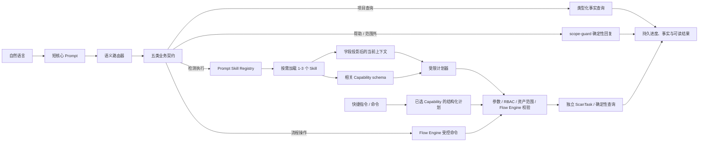

1. 用户在 `/projects/:projectId` 输入自然语言，或从 `/` 命令面板和紧凑“快捷指令”卡片面板选择命令；回车发送，Shift+Enter 换行，方向上键查看历史输入。输入正文从编辑区左侧正常起笔，材料上传、`/` 和快捷指令位于底部工具带，不能占据正文首列。
2. 自然语言由 AI Engine 先归入项目查询、检测执行、流程操作、使用帮助或范围外五类；只有检测执行按需加载业务 Skill、当前项目事实和相关能力 schema 生成结构化 plan。`/` 提供命令检索，“快捷指令”提供可视化工具卡片，两者都从同一工具目录生成并复用资产选择、凭据输入和任务创建。
3. plan 必须通过能力名、参数、目标范围和权限校验；不完整 JSON、把“项目”当成 target、引用项目外资产等结果在执行前纠正、剔除或拒绝。
4. 纯对话直接返回文字；有工具计划时立即创建任务并返回 task ID，不等待扫描完成。
5. 每个任务独立执行，前一个长任务不能锁住输入框或阻止提交下一条命令。
6. 聊天消息保存用户输入、AI 响应、任务 ID 和结果关联；任务进度通过 WebSocket 与轮询更新。
7. 多资产任务只在聊天中产生一个聚合结果消息，详情按资产展开，检测结果中心保留独立执行记录。
8. 自动滚动只在用户位于底部附近或发送新消息时触发；用户上滚查看历史后不得被后台进度强制拉回底部。
9. 刷新项目页后恢复对话历史、运行任务和已完成结果；服务重启时以持久化 ScanTask 和 checkpoint 为准，无法恢复的进程必须明确失败而不是永久运行。
10. 用户可以暂停、继续、停止或删除允许控制的任务；停止请求持久化，工作进程在安全检查点退出。
11. 当前输入明确给出目标时，结构化计划只保留当前输入中出现的目标并按能力和参数去重；历史消息只能辅助理解指代，不能把上一条扫描目标再次加入新任务。
12. 一个组合计划中某个参数无效或目标越界时，只剔除该子步骤并继续执行其余合法步骤；全部步骤都无效时才拒绝任务。LLM 是自然语言检测意图的主路由器和规划器；非法输出先修复一次，服务不可用时只按当前明确的业务语句做小范围降级，不从模糊内容推断执行动作。
13. “Web 扫描”或“Web 漏洞扫描”是能力目录中 `nikto_scan` 的显式别名，其参数契约为 `target`；明确要求 SQL 注入且提供带查询参数的 URL 或 POST 数据时使用 `sqlmap_scan`。该映射用于约束工具 schema，不取代 LLM 对模糊目标、组合任务和上下文的判断。
14. 自然语言、可视化快捷指令和 `/` 工具命令必须创建相同结构的独立 ScanTask；不按入口建立不同队列。Web 扫描 A 与随后提交的端口扫描 B 可以同时运行，谁先完成谁先回写自己的结果，暂停、失败和超时互不改变另一任务状态。
15. 目标执行拓扑拆分为文档分析、测评技术检测、交互检测、整改与重新检查、低优先级维护五类持久队列和独立 Worker 池。每类配置并发上限、租约、心跳和背压；结果始终以任务 ID、项目 ID、资产和能力关联，不能依赖前端请求顺序。
16. Compose 分别运行 `document-worker`、`assessment-worker`、`interactive-worker`、`verification-worker` 和 `maintenance-worker`；页面区分“排队中”和“执行中”，`/ping` 与其他交互入口使用相同任务 ID、WebSocket 和轮询恢复链路。
17. 多 Agent 协作在可靠队列完成后实施。Orchestrator Agent 负责任务分解和汇总，文档、网络、Web、主机等专业 Agent 拥有受限上下文和能力集合；Agent 通过持久任务和结构化结果协作，不能绕过 RBAC、资产范围、Flow Engine、规则裁决或直接写最终合规状态。MCP Tool Server 仍是工具，不视为 Agent。
18. “当前有哪些资产”等清单查询使用 `list_assets` 的确定性结果，不交给 LLM 自由改写。回答必须列出当前项目资产总数、名称、类型、地址和验证状态；结构化结果使用 `query_result`，不伪装成对未知目标执行的扫描卡。
19. “现在合规状态如何”使用 `view_project_status(view=status)`；“能否通过”使用 `readiness`；“主要差距”使用 `gaps`；“管理层摘要”使用 `executive`。四者读取同一持久事实快照但回答目标不同，LLM 只识别意图，不复用历史数字或自由编造结论。
20. 删除聊天内泛化的 `view_scan_results` 查询及其自然语言、快捷按钮和命令入口；它过去只返回缓存对象，无法形成可信业务结果。用户查看正式结果应进入项目“检测结果”中心，具体查询继续使用开放端口、漏洞、Finding、评分和扫描历史等明确能力。
21. 组合检测的总体状态必须按子任务真实终态汇总，外层包装成功不能覆盖子任务的 warning、failed 或 skipped；未完整覆盖时返回明确警告和具体子任务原因。

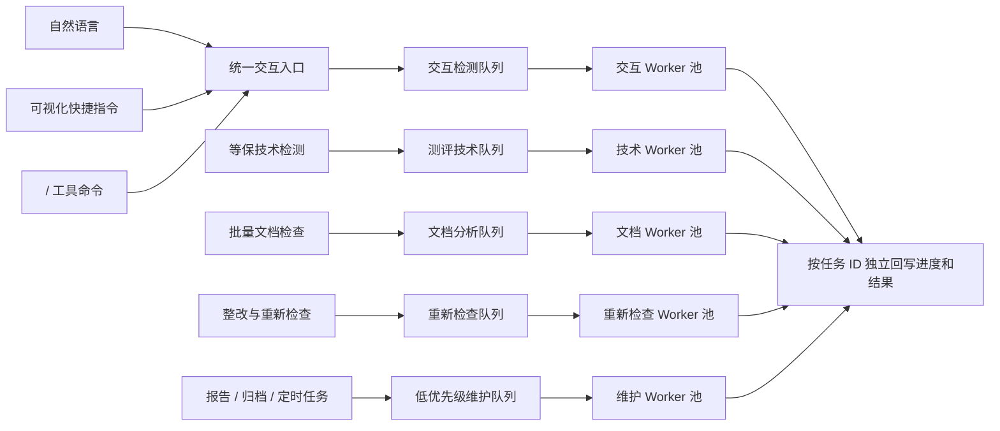

### 5.10 Finding、证据、整改与复测

**状态**：`implemented`。Finding 直接复测模型、文档/技术复测 Worker、自动裁决、阶段联动、重置清理、项目页交互和报告追溯已经落地；不建立中间工单系统。

1. `Finding` 是问题权威记录，使用项目、资产/文档范围、检查项/能力和风险指纹稳定标识问题；描述文字不能作为技术问题匹配主键。
2. 整改与复测工作区按文档任务和技术来源聚合 Finding，同时列出差距分析/现场测评中执行失败的必检任务；用户首先看到“问题是什么、属于哪里、为什么不符合或为什么未完成”。
3. 文档问题支持单类和批量两种整改入口。单类入口可追加文件或替换指定文件；批量入口接收多文件、文件夹、ZIP、RAR 或 7z，并复用差距分析的混合归类。可靠归类后，同类旧版本停用但保留文件与版本关系，新版本成为当前有效材料；无法可靠归类的文件只显示提示，不得更新整改结论。
4. 单类或批量提交后，系统都以该文档任务当前有效的全部文件为输入，重新执行该类全部检查项，并为该类全部 `open` Finding 创建同一个文档 `VerificationRun`，而不是只检查用户点中的一个问题。
5. 文档复测比较相同 `clause_id` 的初检与新结论；原问题消失且新结论可靠通过为 `fixed`，仍不完整为 `still_present`，新增不符合项为 `new`，解析/模型失败为 `unable`。
6. 技术问题按资产、能力和稳定风险指纹创建复测项；相同资产与能力合并成一次真实执行，再把结果分发到相关 Finding，避免一个问题重复扫描一遍。
7. 技术复测需要认证时重新收集凭据；密码、私钥正文和令牌只进入短期加密凭据封装，不得写入普通任务参数、日志、事件或报告。
8. `VerificationRun` 状态为 `queued → running → completed/partial/failed/cancelled`；`VerificationItem` 结论为 `fixed/still_present/new/unable/cancelled`，并保存初检观察、复测观察、前后差异和错误。
9. 复测运行保存心跳、租约和恢复次数；独立续租监视器在单个长工具调用期间也持续刷新租约，而不是只在能力组结束后续租。支持停止、继续和刷新恢复；Worker 失联后只重领未完成目标/能力组，迟到结果不能覆盖已停止终态。
10. 只有 `fixed` 可以自动把 Finding 改为已修复；`still_present/new/unable/cancelled` 均保留或新增活动问题。
11. 主流程不提供“接受风险”“手工通过”或“直接关闭”入口；未修复和无法验证项保持活动状态。报告可以如实披露这些问题，但只有修正材料、凭据、参数、网络或工具条件并真实复测为 `fixed` 才能关闭 Finding。
12. 文档 Finding 若 `judgment=not_tested`，表示正文提取或模型判证尚未可靠完成；用户必须重新上传可解析材料、重新分析或恢复视觉/LLM 能力。
13. 差距分析和现场测评的必检任务失败时，即使没有产生 Finding，也会作为 `execution_blocker` 阻止自动完成；修正网络、凭据或工具条件后可返回原阶段重试，也可生成带明确覆盖限制的当前状态报告。
14. 当所有 Finding 均已获得 `fixed/still_present/new/unable` 终态复核、没有运行中的复测且没有执行阻断项时，“整改与复测”自动完成并激活报告。阶段自动完成表示复核覆盖完成，不表示所有风险已修复。
15. 页面提供“以当前结果生成报告”：只在没有运行中复测时可用，明确显示将带入报告的待处理和无法验证数量。该动作仅结束本轮流程并保存问题快照，不提供“复测通过”“关闭问题”或伪造合规结论的能力。
16. 用户以当前结果进入报告后，尚未复核、已取消、仍存在、无法验证和执行阻断均保持原状态并进入报告；再次提交改进文档或技术复测时，Flow Engine 清除报告快照、重新打开整改阶段并把报告任务恢复为 `todo`。
17. 页面先显示明确的“下一步”，再展示当前问题、执行阻断、运行进度、停止/继续、前后对比和事件时间线。
18. 单项、阶段和整体重置同步清理对应 VerificationRun、VerificationItem、FindingEvent 和派生状态；重开 Finding 或重置上游阶段时报告任务恢复为 `todo`。
19. HTML 报告读取同一事实模型，展示初检、重新检查、已修复、未解决、新增和无法验证，不从名称或任务完成百分比猜测结论。
20. 工作区提供“待处理、已修复、无法验证、全部”四个筛选，文档与技术问题按来源聚合；初检后尚未重新检查的 `open` 和重新检查后仍存在的 `still_present` 都归入“待处理”。问题列表独立滚动，避免数据增多后挤出操作区。
21. 文档组的首要动作是“上传改进文档并重新检查”，技术组的首要动作是“重新执行该项检测”。
22. 每个 Finding 只显示一个当前权威状态：`待处理/复测后仍存在/已修复/无法验证/重新检查中`。完整复测历史收进“复测记录”弹窗，默认收起逐项明细，主工作区只保留最近一次摘要，`completed/partial/failed/cancelled` 都必须可追溯。
23. 阶段显示“本轮结束”而不是“全部完成”；它表示本轮复核或用户快照已经结束，不表示全部 Finding 已修复或项目已经合规。

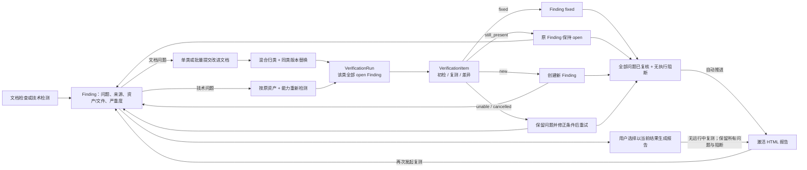

实现验收：数据库迁移 `013_reopen_accepted_risks` 已在 PostgreSQL 执行，旧的管理性关闭捷径全部恢复为待整改；项目 70 的最新 Web 复测可逐项显示资产、工具、`still_present/new` 结果、原始发现和任务 ID。`check_verification_contract.py`、`check_verification_lifecycle.py` 和自动化测试通过。`build_real_compliance_documents.py` 与 `check_real_material_api_flow.py` 使用真实 DOCX、文本 PDF、扫描 PDF、批量材料和受控 SSH/Web 靶机，从空项目验证错误凭据失败、正确凭据重试、文档改进材料、技术复测、不适用项和四阶段 HTML 报告；报告明确保留已修复、仍存在和无法完成的覆盖限制。

### 5.11 HTML 报告生成

**状态**：`implemented`。

1. 用户先结束本轮整改与复测；Flow Engine 激活第四阶段及唯一 `html_report` 任务。报告中心只预览和下载已生成版本，不绕过流程临时生成正式报告。
2. 后端校验 `report:export` 权限，确认全部前序阶段完成、差距分析/现场测评正式任务均到达终态，并确认技术检测、文档分析和整改复测均无运行中任务；存在未执行或活动任务时拒绝生成并显示分类数量。
3. 报告服务读取当前项目、资产、四阶段真实进度、`source=assessment_task` 的测评扫描、文档结论、Finding、证据、复测和变更数据，构建一次不可变 JSON 快照；交互/定时扫描不进入正式快照，也不阻塞报告生成；生成报告只能完成报告任务，不能反向把未完成上游阶段强制写成 100%。
4. 服务根据同一快照渲染 HTML，计算 SHA-256 和文件大小，创建递增版本的 `ReportArtifact`；任务完成后测评才达到 100%。
5. 预览、HTML 下载和 JSON 导出都读取同一个 `ReportArtifact`，不得在读取时重新拼接最新数据库事实。
6. 报告按“执行摘要、范围、差距分析、现场测评、问题清单、整改状态、复测对比、变更提示、最终结论”组织。
7. 每条问题显示资产或文档归属、来源工具/检查项、严重程度、状态、解决时长和可追溯证据。
8. 未执行、执行失败、无法分析和无风险必须分开展示；覆盖率不足时不能给出“全部合规”结论。已跳过、仍存在、新增和无法验证项保留原结论。
9. 只有测评流程内的技术任务重跑、文档上传/重新分析、整改复测、阶段重开或重置会把当前产物标记为 `stale`，记录原因并把报告任务恢复为 `todo`；聊天、`/`、快捷指令、扫描 API 和定时监控产生的独立检测不得改写当前报告；旧版本保留追溯，重新生成得到下一版本。
10. 报告使用正式任务类型和能力目录生成中文检测名称，不能暴露 `targeted` 等内部枚举或对象字符串；正式格式只保留 HTML，不维护 PDF 主流程。
11. 项目页通过 `GET /projects/{project_id}/reports` 获取报告历史，通过 `GET /projects/{project_id}/reports/{version}` 预览或下载指定版本；这两个具体路由必须定义在 `/{project_id}` 动态详情路由之前，避免被 FastAPI 动态路由截获。
12. 报告生成时把 Flow Engine 当前评分指标写入快照的 `score_metrics`，并同步到快照 `project.compliance_score`；历史列表不得展示旧的空评分作为有效 current 报告。
13. 评分规则变更迁移会把旧 current 报告标记为 `stale`，原因写明“失败和无法验证项现按 0 分计入”，并把报告任务恢复为 `todo`，要求用户重新生成可信报告。

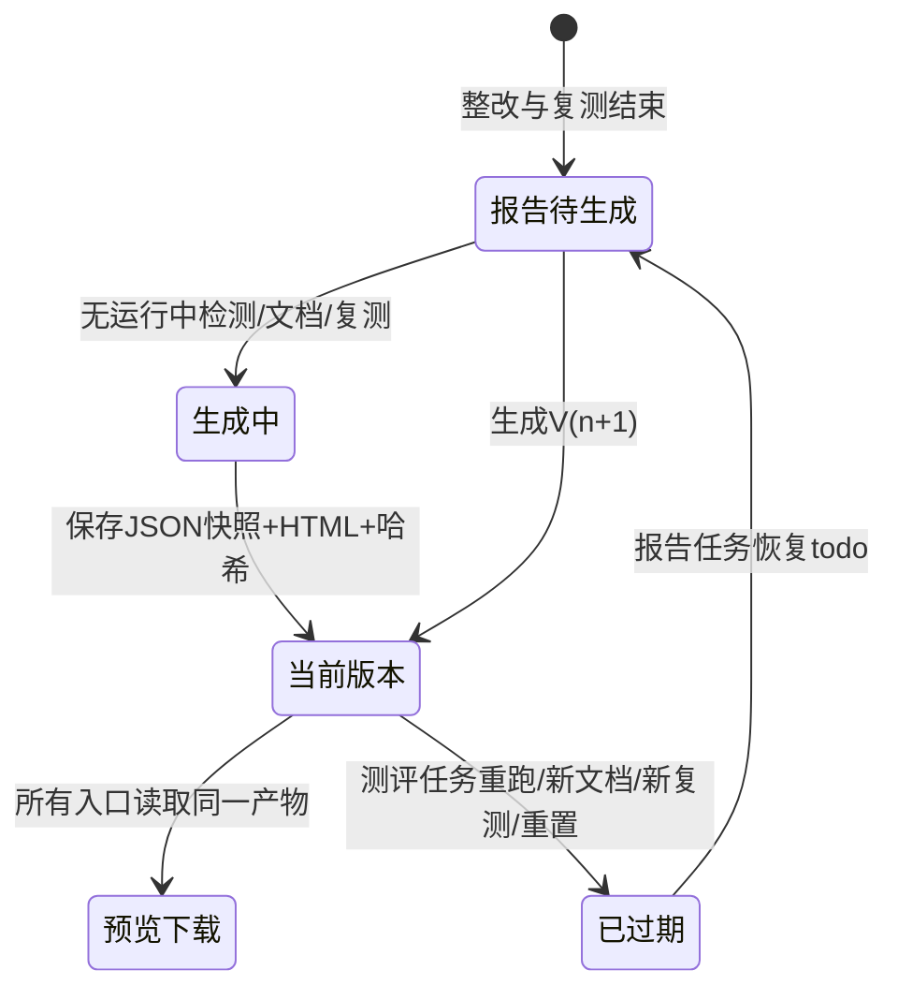

验收要求：测试报告必须同时包含技术初检问题、文档问题、整改动作、技术/文档复测、已修复与仍存在结果；同一版本的 HTML/JSON 哈希和内容保持稳定，新的测评材料、测评任务重跑、复测或重置必须使旧版本过期，独立工具检测不得使其过期。

### 5.12 资产与端口变更检测

**状态**：`implemented`。

1. 系统在资产集合或有效端口扫描完成后生成项目快照。
2. 新快照与上一个已确认快照比较，生成新增资产、删除资产、新增开放端口和关闭端口事件。
3. 变更事件记录项目、资产、旧值、新值、检测来源和时间。
4. 项目页显示“需要重新评估”提示，并允许跳转到对应资产或重新执行检测。
5. 用户确认变更后事件从待处理队列移出，但审计信息仍可查询。
6. 扫描失败或结果不完整时不得生成“端口已关闭”的变更结论。

### 5.13 项目、对话与线程归档

**状态**：项目归档、对话归档和恢复已实现；压缩导出为 `accepted-pending`。

1. 项目归档把项目从活动工作区移到归档区，并限制为只读；资产、扫描、Finding、证据、整改和报告仍可查看。
2. 恢复归档项目只改变项目状态，不复制或重建原数据。
3. 对话归档创建持久化归档任务，由 Worker 生成结构化摘要；状态为 queued、processing、completed 或 failed。
4. Worker 使用租约领取任务；中断后过期租约可被重新领取，明确失败需要用户重试。
5. 用户可以查看、删除、重试归档，并从归档摘要创建或继续线程。
6. 对话线程保存项目范围，继续时恢复摘要而不是把全部历史无上限注入模型。
7. 压缩导出完成后应生成 HTML 报告、结构化 JSON、证据索引和附件清单；压缩包只用于导出，不成为新的运行时数据源。

### 5.14 模型与 OCR 配置

**状态**：模型供应商配置和三层文档解析策略已具备主体能力，完整文档视觉模型的跨平台容器能力仍需持续验证。

1. 管理员在模型设置页创建供应商和模型配置，测试连接后才将其设为可用。
2. AI 对话、文档分类和证据判定按用途选择配置，不在业务代码中硬编码供应商。
3. 文档解析模式包括原生解析优先、轻量 OCR fallback、完整文档视觉模型三层。
4. 标准模式在原生结果为空或可疑时自动补充 OCR；深度模式对复杂页面做视觉交叉验证。
5. OCR 默认在本地容器处理企业材料；部署到不同 CPU/GPU 环境时允许切换推理后端，但 OCR Service 和 MCP Gateway 对外保持统一可路由的 `document_page_parse` 契约。
6. 模型不可用、超时或崩溃必须被隔离为单页/单任务错误，不能导致 Worker 永久占用或把检查判为通过。
7. 模型密钥和文档凭据不得出现在 API 返回、日志、报告和架构文档中。

### 5.15 诊断、健康与工具遥测

**状态**：`implemented`。

1. `/health` 用于服务级存活检查；`/diagnostics/mcp/health` 汇总 MCP Gateway 和 Tool Server 健康状态。
2. 健康探测并发执行，避免低配置环境中多个 10 秒探测串行叠加；MCP Gateway 或工具路由不可用时整体为 `unhealthy`，单个工具服务降级、超时或缺少可选二进制时整体为 `degraded`，并保留具体服务和错误类型。
3. `/diagnostics/operations` 展示工具路由、依赖二进制和典型参数烟测结果。
4. 单工具诊断使用安全测试参数验证路由、参数契约和返回结构，不把诊断失败解释为目标资产风险。
5. Dashboard 工具遥测读取健康与最近执行事实，显示工具名称、图标、成功率、最近错误和更新时间。
6. 工具不可用时，执行入口仍可见但明确标记不可用；用户触发后快速失败并给出依赖或路由原因。
7. 后端、Worker、Gateway 和 Tool Server 日志使用任务 ID、项目 ID、资产和能力名关联，但必须脱敏密码、密钥和令牌。

### 5.16 删除、清理与数据规模控制

**状态**：`implemented`。扫描结果删除、测评重置、项目文档清理、组织业务初始化、容量遥测和标准图谱保护已形成闭环。

1. 检测结果页支持单选、多选和一键删除项目扫描结果；后端级联删除 ScanTask、关联 Finding 和结果数据，并返回实际删除数量。
2. 测评单项、阶段和整体重置按 5.5 节清理各自范围，不允许只重置进度条。
3. 文档文件和内容块按 SHA-256 去重；同一有效内容只保存一份原文和可复用嵌入。
4. 向量索引只保留当前有效材料和检查所需命名空间；被替换材料的向量、临时页面和 OCR 缓存自动回收。
5. 标准图谱独立于项目业务数据，只保存一套版本化标准关系；项目证据图谱只保存有效结构和确认使用的证据关系。
6. 三级清理入口分别为：重置本次测评、清空项目文档业务数据、初始化组织业务数据。组织业务初始化只在 `/settings/data-lifecycle` 提供并要求 `system:config`；任何一级都不能删除标准图谱和系统权限模板。
7. 删除采用后端事务和提交后的文件清理；物理文件删除是幂等操作并最多重试 3 次，仍失败时记录准确路径，不能向前端假报全部成功。
8. 存储遥测展示原文件、解析产物、向量、OCR 缓存、扫描结果和报告各自占用；完全重置完成后显示实际删除记录数、文件数和释放字节。
9. 测评完全重置提交数据库清理后再幂等删除物理文件；文件删除失败时返回准确残留路径和实际释放统计，不能把已删除的数据库事实伪装成仍可用。

删除边界：项目文档清理只删除文档运行、内容块、向量、文档 Finding/Evidence/Verification 和项目证据图谱，保留资产及技术扫描；测评完全重置删除当前项目全部测评派生事实但保留项目与资产；组织业务初始化删除组织下全部项目业务数据，保留组织、成员、权限角色和全局标准图谱。数据库删除在事务内完成，物理文件在提交后删除，失败路径进入返回结果和运维日志。

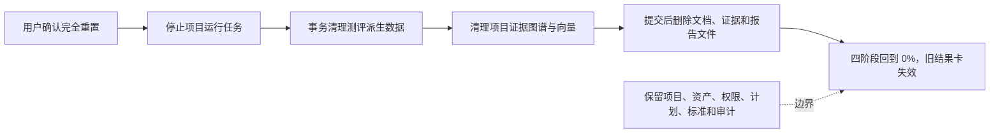

## 六、产品模块清单

| 模块 | 权威职责 | 关键页面/入口 | 状态 |
|------|----------|---------------|------|
| 认证与组织 | 登录、注册、Token、组织上下文和成员管理 | 登录页、`/settings/access` | implemented |
| 角色权限 | 基础身份、系统/自定义权限模板、成员授权和审计 | Dashboard、`/settings/access` | implemented |
| Dashboard | 组织概况、项目矩阵、真实资产拓扑、风险队列、工具遥测 | `/dashboard` | implemented |
| 项目管理 | 创建、编辑、归档、恢复、删除和演示项目 | `/projects` | implemented |
| 资产管理 | 跨项目资产矩阵、授权确认、资产增删改查 | `/projects?view=assets` | implemented |
| 项目执行 | AI 对话、快捷命令、并发任务、测评和聚合结果 | `/projects/:projectId` | implemented |
| 四阶段测评 | 阶段依赖、任务矩阵、执行覆盖、严格门禁和三级重置 | 项目执行页 | implemented |
| 文档解析 | 原生解析、OCR/视觉补充、内容块和融合 | 项目执行页、Worker、OCR Server | implemented |
| 标准与检索 | Apache AGE 标准/证据图谱、pgvector/关键词召回和规则裁决 | 后端文档服务 | implemented |
| 工具检测 | 端口、Web、漏洞、弱口令、数据库、SNMP、Windows、基线 | 项目执行页、MCP | implemented |
| 任务与结果 | 持久任务、进度恢复、结果归一化、多资产聚合和批量删除 | 项目页、结果中心 | implemented |
| 整改复测 | Finding、VerificationRun/Item、自动裁决、时间线和阶段联动 | 项目执行页 | implemented |
| 整改建议编排 | 按 Finding 生成结构化整改建议并协调文档/技术复测，不直接改结论 | Orchestrator、Flow Engine、Verification 服务 | accepted-pending |
| 报告中心 | 版本化正式 HTML 报告及其同源 JSON 快照的状态、预览和导出 | `/reports` | implemented |
| 变更检测 | 资产/端口快照、变更事件和重新评估提示 | 项目执行页 | implemented |
| 归档 | 项目只读归档、对话摘要、线程继续与恢复 | 项目列表、项目对话 | implemented |
| 压缩导出 | HTML、JSON、证据索引和附件清单打包 | 归档/报告 | accepted-pending |
| 模型配置 | LLM 供应商、用途配置、连接测试和 OCR 策略 | `/settings/models` | implemented |
| 数据生命周期 | 结果删除、三级清理、向量/OCR/图谱自动回收和容量遥测 | 结果页、项目设置、`/settings/data-lifecycle` | implemented |

## 七、体验原则

- 对话是项目执行页核心入口，不能因为任务执行阻塞新输入。
- Dashboard 只展示组织态势，不放对话指令。
- 自然语言、可视化快捷指令和 `/` 命令必须共用同一能力目录。
- 多资产、多工具结果必须聚合展示，不能刷屏。
- 每个结果必须说明资产归属、执行内容、成功/失败原因和可操作下一步。
- 不确定、提取失败、工具不可用必须明确显示，不能伪装成通过。
- 文档合规判断必须引用标准库和证据位置，不能只靠 Prompt。
- UI 风格保持高端网络安全 SaaS：深色、克制、清晰、可滚动、可展开。

## 八、当前仍需关注的问题

| 问题 | 当前边界 | 已确认处理方向 |
|------|----------|----------------|
| 标准库专业校准尚未完成 | 当前先保证 10 类文档、至少 80 个必检点和正确自动判证方法 | 主流程稳定后再由专业人员校准依据、阈值和扩展到 21 类文档 |
| OCR/视觉模型存在环境差异 | Apple Silicon、ARM64、CPU/GPU 和容器运行时可能影响推理后端 | 保持统一接口和三层策略，为各平台选择稳定后端并做真实文档回归 |
| AI 整改建议编排尚未落地 | 确定性 Finding 直接复测闭环可用，自然语言整改建议和批量复测编排仍是后续能力 | 通过公开命令生成整改建议并协调复测，不引入工单，也不拥有最终状态 |
| 公网工具受网络路径影响 | 容器出口、目标防火墙、限速和协议握手会造成 filtered、timeout 或 refused | 结果严格区分端口状态、网络失败、认证失败和工具失败，并提供诊断入口 |
| 外部扫描器不支持进程内断点 | Worker 已能按文件或资产检查点恢复，但 nmap、nuclei 等单次二进制进程中断后仍需重跑该未完成子工具 | 停止时终止实际进程；恢复时只重跑未完成资产/能力，不重复已完成检查点 |
| 归档压缩尚未落地 | 项目和对话归档可用，但还没有完整离线包 | 增加 HTML、JSON、证据索引和附件清单的可验证压缩导出 |
| Pydantic 2 迁移告警 | 当前测试全部通过，但部分 Schema 仍使用旧式 `Config` | 分批改为 `ConfigDict`，在 Pydantic 3 前消除弃用告警 |

## 九、验收口径

当前产品是否可用，以这些场景验收：

- 注册后自动创建组织和管理员关系；只读角色不能执行扫描、重置测评或修改权限。
- 创建项目和资产后，未确认授权的资产不会进入“全部资产”扫描，项目外地址不会被 AI 错误注入。
- 新建项目后只出现 4 阶段流程。
- Dashboard、项目页、报告页不再出现旧流程阶段。
- 差距分析的文档和技术区域可以分别自动批量执行，也保留单项手动执行。
- 批量上传文件、文件夹或压缩包后能看到逐阶段进度、文档分类、命名提示、检查点结论、证据位置和整改项。
- DOCX 段落/表格/页眉页脚/图片、文本 PDF、扫描 PDF 和混合 PDF 均能产生带位置内容块。
- 向量、关键词和图谱联合检索能为同一检查项组合相邻段落、表格及跨文件证据。
- 文档解析失败时显示 `unable`，不算通过。
- PDF/OCR 暂时超时会显示尝试次数并最多执行 3 次；三次失败或必需文档缺失时形成可见 `unable/not_tested` Finding，不能静默漏项。
- LLM 不可用时不得使用关键词命中直接判定文档通过。
- 对多个资产执行工具时，结果按资产聚合展示。
- 工具失败时能看到具体原因。
- 错误 SSH 密码只让依赖认证的任务失败，不能让整个差距分析显示全部通过。
- 同时提交两条长任务时，第二条可以立即创建，聊天输入不被第一条阻塞。
- 正式报告生成后，聊天、`/`、快捷指令、扫描 API 或定时监控的新任务只新增检测记录，不得让四阶段进度从 100% 回退、清空合规分或把报告标为过期；从测评流程重跑、上传材料、复测或重置时才允许使报告过期。
- 用户上滚查看历史消息时，后台进度不得强制滚动到底部。
- 手动工具测评、等保技术检测和组合扫描都能产生进度和结果。
- 失败或部分执行不能关闭历史 Finding；完整复测且风险消失后才能自动解决。
- 整改后通过上传改进文档或重新执行原资产/能力完成复测，不建立空转工单。
- 复测仍在运行时报告阶段保持锁定；没有运行中复测时，用户可以选择以当前结果生成报告。必检任务失败、文档结论不可靠、已取消复测、尚未复核、`still_present` 和 `unable` 都必须保留原状态并进入覆盖限制，不能计为修复或通过。
- 差距分析或现场测评仍有 `todo/in_progress` 正式任务时不能生成正式报告；报告快照不能把未完成上游阶段改写为 100%。
- 正式阶段不能跳过或跨越，自动化任务不能由页面人工标记完成。
- 完全重置测评时，进度、技术扫描、文档与向量、证据、Finding、整改复测、变更快照、缓存和全部报告版本同步清空，项目资产、权限、计划配置、标准库与审计记录保留。
- 单项和阶段重置只清理对应范围；只有明确点击完全重置才删除项目级全部测评历史。
- 已完成任务普通重跑不会删除已修复 Finding 和重新检查记录；只有明确点击单项、阶段或整体重置才执行对应清理。
- HTML 报告能展示初检、整改、复测和最终结论。
- 正式报告由第四阶段生成并保存为递增版本；预览、HTML 和 JSON 使用同一快照，测评任务重跑、材料、复测或重置使旧版本明确过期，独立工具检测不影响当前版本。
- HTML 报告中的工具名、资产、执行状态、检测结论和错误原因均为可读业务文本，不出现 `targeted`、对象字典或 `[object Object]`。
- 批量删除扫描结果后数据库关联记录和存储产物同步释放，不残留孤立 Finding。
- 清空项目文档数据时删除内容块、向量、证据图谱和 OCR 缓存，但标准图谱保持完整。
- 建立专用自动化验收项目和测试文件，从空项目真实跑完差距分析、现场测评、整改与复测和 HTML 报告；报告必须同时包含文档与技术初检问题、改进材料、已修复、仍存在、新增和无法复测场景。

### 9.1 最近一次综合验收

**执行日期**：2026-07-19。下列结果来自当前 Docker Compose 运行环境，不是手工修改数据库得到的演示数字。

| 验收层 | 实际覆盖 | 结果 |
|--------|----------|------|
| 自动化测试 | 文档、图谱、资产范围、队列控制、复测、报告、重置、删除、工具语义、权限边界、评分回填、测评幂等初始化、五类对话契约、确定性项目查询、Prompt Skill 路由、能力白名单、拓扑风险口径与服务提取 | 163 项通过；仅保留 Pydantic 2 弃用告警，无测试失败 |
| 部署 API 烟测 | 临时项目、授权资产、四阶段初始化、技术任务、异步文档分析、报告门禁、完全重置、项目删除 | 通过；临时项目和任务已自动清理 |
| 标准与检索 | 10 类核心文档、40 个控制域、80 个必检项、291 个标准图谱节点；精确检索 + 1024 维向量 + AGE 归属 | 通过 |
| 真实材料闭环 | 项目 `P-072` 从空项目上传 11 个文件，10 类正确归类、1 个无关文件保持未归类；覆盖 DOCX、文本 PDF、扫描 PDF、原生/OCR 路径 | 10 类文档检查全部形成结论 |
| 技术初检 | 受控靶机真实开放 SSH/HTTP/HTTPS；错误 SSH 密码与正确凭据分别执行；端口、漏洞、基线、弱口令、SSL、Web、数据库、SNMP、Windows/SMB 等进入结果矩阵 | 错误凭据明确失败；不适用、超时、风险和完成状态未互相冒充 |
| 整改与复测 | 3 类改进文档、未修改文档复核、技术问题按资产/能力重检、长时间漏洞工具调用 | 40 个问题中 5 个已修复、35 个保持待处理、3 个无法验证；长调用期间租约持续更新 |
| 正式报告 | 四阶段门禁、当前事实快照、HTML、哈希、版本、过期语义和可读业务文本 | 正式报告 V1 生成；本地验收副本为 `artifacts/certiproof-real-material-report.html` |
| 交互并发 | 连续提交 Web 扫描与双资产端口扫描，重复资产去重，独立任务 ID 和结果归属 | 当前镜像两次创建耗时 0.014 秒和 0.010 秒；结果分别归属 `e2e-target`、`redis` |
| 工具层 | Docker 内部真实端口、异步进度、数据库组合、SSH 错误、Web/目录/模糊测试、SNMP、Windows/SMB | 工具烟测通过；不可达和不匹配服务保持“未完成/无法判断” |
| 已授权公网抽样 | `121.40.95.31` 高危端口、SSL、Web | 主机可达，23 个端口为 filtered；SSL 90 秒、Web 120 秒超时均保留具体原因，未误报“无风险” |
| 生命周期 | 文档、内容块、向量、证据图谱、扫描结果、文件和项目删除 | 临时数据已清理；291 个全局标准节点完整保留 |
| 进度一致性 | 单项目唯一测评、确定性最新记录、只读整改工作区、运行态轮询和刷新恢复 | 迁移 `020` 已删除空重复实例；项目 72 在刷新、5/8 秒轮询周期和用户上滚后保持 100% 与原滚动位置，数据库无重复测评实例 |
| UI | Dashboard、项目与资产、报告中心、项目执行页、检测列表、模型设置、访问控制、数据生命周期；桌面 1280px | 无页面级横向溢出；自然语言、32 项快捷指令卡片和 39 条 `/` 命令互不重叠；组织、项目、资产、服务检查器、风险筛选和项目汇总切换经真实页面点击验证 |
| 构建与部署 | Python 编译、Vite 生产构建、迁移、并发 MCP/AGE/向量诊断 | 核心路由与全部安全工具服务健康；当前 Apple Silicon/Colima 下完整文档视觉模型降级为轻量 OCR fallback，扫描 PDF 实测可完成 |

验收边界：公网目标受容器出口、防火墙和限速影响，工具“超时/filtered”是可信执行事实而不是平台故障；当前容器的完整文档视觉模型依赖 fallback 保证扫描件可用，复杂图表理解仍需在目标生产硬件上复验；标准库仍需后续专业校准，Pydantic 2 弃用告警应在升级 Pydantic 3 前消除。

## 十、架构记忆

### 10.1 维护规则

- `.opencode/plans/ARCHITECTURE.md` 是产品与系统架构的唯一 Markdown 事实源。
- `docs/certiproof-product-design.html` 由 Markdown 自动生成，只用于查阅和讲解，不手工修改。
- 文档只保留当前已实现设计和当前已经确认的目标设计，并明确区分两者。
- 功能重做采用一次性完整替换，不保留旧数据结构、旧接口、旧页面或兼容分支。
- Git 历史只用于找回仍然有效的设计依据，已废弃方案不写入现行文档。

### 10.2 当前关键决策

| 领域 | 当前决定 | 影响范围 | 状态 |
|------|----------|----------|------|
| 产品定位 | 面向被测企业的等保合规自查平台，不作为测评机构作业工具 | 全产品 | implemented |
| 流程 | 统一使用“差距分析、现场测评、整改与复测、生成报告”四阶段 | 测评、复测、报告 | implemented |
| 交互 | Dashboard 展示组织态势，项目执行页以对话和自动化测评为核心；Dashboard 重复的检测结果入口替换为不跳转的密码测评预告 | Dashboard、项目页 | implemented |
| 项目工作台 UI | 项目执行页采用约 88px 图标文字导航、约 332px 四阶段流程轨道、弹性中央 AI 对话和宽屏约 560px 测评详情；输入区保留上传、`/`、紧凑快捷指令和发送，`/` 命令检索与快捷工具卡片互斥显示；任务与结果卡可点击展开，顶部指标固定对齐；左右业务面板独立收起后仅显示图标把手；待处理数量单行显示；页头徽标 3D 水平翻转，对话头像和水印静止；等值轮询不改写前端状态，大面积面板不使用背景模糊以保持滚动稳定 | `/projects/:projectId` | implemented |
| 项目资产与设置 | 当前项目资产在项目设置中维护并明确显示资产类型和所属项目；跨项目资产留在统一资产视图；项目设置返回当前项目对话，组织级设置返回 Dashboard，失效项目 URL 自动纠正 | 项目设置、组织设置、资产 | implemented |
| 组织设置边界 | 访问控制与数据生命周期使用 Dashboard 同源导航；成员、身份、权限模板和审计集中在 `/settings/access`，容量与组织业务初始化集中在 `/settings/data-lifecycle`；项目页只展示本人有效权限，不提供组织管理入口 | Dashboard、项目页、组织设置、RBAC | implemented |
| 技术检测 | 自然语言、`/`、快捷指令和扫描 API 共用能力目录与独立交互队列，多资产结果统一聚合；交互/定时检测保留结果和变化提示但不改写正式测评事实；正式记录从检测结果中心查看 | 对话、任务、结果 | implemented |
| 报告 | HTML 是正式报告格式；第四阶段生成版本化 `ReportArtifact`，保存 JSON 快照、HTML、哈希、评分快照和过期状态；只有测评任务重跑、材料、复测、阶段重开或重置会使当前报告过期，独立检测不影响；项目页和报告中心均从同一历史接口读取版本 | 报告中心、项目页、文件存储、数据生命周期 | implemented |
| 文档合规 | 混合解析、混合归类、混合检索、图谱补全、LLM 判证、规则裁决 | 文档、证据、整改、报告 | implemented |
| 标准库 | 运行时使用正式知识图谱，YAML 仅作初始化、导入导出和备份 | 标准、检索、判证 | implemented |
| 图谱引擎 | 使用 Apache AGE 属性图并与 PostgreSQL、pgvector 同库部署；不依赖商业版图数据库 | 标准、证据、部署、备份 | implemented |
| 可复现部署 | Git 保存完整构建输入，前端在 Docker 内构建，Compose 自动迁移，模型按需下载到持久卷 | 构建、部署、升级、运维 | implemented |
| 数据策略 | 新文档子系统完整替换旧实现，旧数据不迁移，完成后从空数据验收 | 数据、接口、页面、测试 | implemented |
| 数据规模 | 在线索引只保留当前有效材料，并提供测评、项目、组织三级清理 | 向量、图谱、OCR、存储 | implemented |
| 长任务可靠性 | 文档按文件、技术检测按资产保存检查点；心跳租约检测失联；复测长工具调用由独立监视器持续续租；停止贯通 Worker、Gateway 与 Tool Server | 文档、测评任务、复测、MCP、UI | implemented |
| 瞬时失败重试 | PDF/OCR 等瞬时提取错误按文件最多尝试 3 次并显示进度；确定性错误不重试，最终失败进入 unable/Finding | 文档、Worker、复测、报告 | implemented |
| 流程边界 | Flow Engine 独立拥有四阶段状态机，Orchestrator/AI Engine 只能通过命令调用 | 测评、对话、任务、审计 | implemented |
| 进度一致性 | 一个项目只有一个当前测评；创建操作加项目行锁并幂等复用；GET 查询只读；Flow Engine 仅在业务写入后汇总进度，前端运行态每 5 秒恢复持久化状态 | 测评、Dashboard、整改工作区、报告 | implemented |
| 流程门禁 | 正式阶段不可跳过或跨越，自动化任务不可人工完成；运行中复测阻止报告，其他未解决、未复核、无法验证和执行阻断可由用户选择以当前快照进入报告并如实披露 | 测评、复测、报告 | implemented |
| 整改闭环 | 使用 Finding、VerificationRun、VerificationItem 和 FindingEvent 形成权威链路；只有真实复测可以关闭问题，用户可结束本轮整改并生成保留未解决项的当前状态报告 | 整改、复测、流程、报告 | implemented |
| 整改材料 | 支持单类上传和文件/文件夹/ZIP/RAR/7z 批量提交；可靠归类后替换同类当前版本并自动复测该类全部未解决检查点，旧版本保留审计 | 文档、整改、复测、存储 | implemented |
| 执行与结论 | 任务完成只代表执行终态；风险、受限、不适用和无发现独立归一化，流程进度不冒充合规分 | 项目页、结果、测评、报告 | implemented |
| 评分口径 | 符合 1 分、部分符合 0.5 分、不符合/失败/无法验证 0 分；不适用排除，未开始/执行中不提前计分；检测覆盖率和无法判定数量独立展示 | 项目页、完成页、报告 | implemented |
| AI 五类对话契约 | 用户输入严格归入项目查询、检测执行、流程操作、使用帮助或范围外；范围外不再退化为通用聊天，重复业务意图从 Skill 目录删除 | AI Engine、Prompt Skill Registry、项目对话 | implemented |
| AI Prompt Skill 编排 | 使用短核心 Prompt、五类语义路由器和按需 Prompt Skill Registry；只有检测执行进入受限计划器，结构化入口直接复用同一执行契约 | AI Engine、Orchestrator、Context Manager、Capability Registry | implemented |
| AI 编排与契约兜底 | LLM 是语义路由和检测规划主路径；非法契约先修复一次，服务不可用时只对明确业务语句使用小范围降级；代码始终校验 Skill 白名单、当前资产、权限和参数 schema | AI Engine、Orchestrator、资产范围 | implemented |
| 独立任务调度 | 自然语言、可视化快捷指令和 `/` 命令共用交互检测队列；不同任务并发执行、独立返回，不因前一任务耗时而阻塞 | 对话、测评、文档、Worker、结果 | implemented |
| 查询结果契约 | 资产、状态、通过准备度、主要差距、管理层摘要、问题和既有检测事实使用确定性摘要与 `query_result`；主要差距按 Finding 类型聚合数量、范围和代表性证据，不由模型改写 | AI 对话、Orchestrator、Flow Engine、结果卡 | implemented |
| 拓扑风险口径 | 待处理风险只统计活动状态的严重/高危/中危 Finding 并排除检测未完成占位项；组织和项目区分全部待处理、资产归属和未归属风险；资产状态按严重/高风险、待关注、当前无待处理、未验证互斥分区 | Dashboard、Finding、扫描任务、资产拓扑 | implemented |
| 拓扑节点检查器 | 组织、项目、资产组、资产和服务共用右侧检查器；服务取最近含开放端口证据的扫描，项目汇总为检查器切换，节点筛选和缩略图共享选中态 | Dashboard、资产、扫描结果 | implemented |
| Worker 隔离 | 文档、测评技术、交互检测、整改复查和维护任务使用独立持久队列与受控 Worker 池 | Worker、部署、诊断、任务控制 | implemented |
| 受控验收环境 | Compose `acceptance` profile 内置真实 SSH/HTTP/HTTPS 靶机，用于错误凭据、开放端口、Web/SSL、复测和报告自动验收 | 部署、工具、CI/本地验收 | implemented |
| 多 Agent 协作 | 在可靠队列之上增加 Orchestrator 与文档/网络/Web/主机专业 Agent；Tool Server 仍是工具，Flow Engine 和规则引擎保持最终状态权威 | AI、编排、工具、测评 | accepted-pending |
| 未完整结果 | 顶层和组合工具的超时、无响应、受限或未完成统一计为 warning/不可判定，保留具体原因，不得冒充成功或零发现 | 执行、结果、复测、报告 | implemented |
| 重跑与重置 | 普通单项重跑保留整改/重新检查记录；显式单项、阶段、整体重置分别执行破坏性清理 | 测评、Finding、复测、报告 | implemented |
| 受限结论 | 技术未完成和文档 `not_tested` 都保持活动状态；完成真实复核后可在报告中保留 `still_present/unable`，但不能把它们关闭或计为通过 | 文档、技术、整改、报告 | implemented |
| 整改建议编排 | 后续能力只生成建议并协调确定性命令，不引入工单、不拥有最终状态 | 复测、Orchestrator | accepted-pending |
| 架构记忆 | 讨论结论更新本文并重新生成独立 HTML；旧设计不进入现行正文 | 产品与系统文档 | implemented |

---

**文档版本**: v4.18
**最后更新**: 2026-07-19
**维护者**: CertiProof Team
